# Why latency degrades under load and how to fix it

## The setup

### Request flow

A load generator (wrk2) sends HTTP requests. The server receives them on Netty event
loops, hands off to virtual threads (VTs) that make a blocking HTTP call to a mock
backend, then writes the response back. Each request touches three stages: **read**
(Netty event loop), **process** (VT doing blocking I/O), **write** (back on the
event loop).

Blocking I/O in Loom uses a two-level poller design (see [Poller.java](https://github.com/openjdk/jdk/blob/master/src/java.base/share/classes/sun/nio/ch/Poller.java)).
**Sub-pollers** are long-running pinned VTs that watch fds for blocked VTs. When a VT
blocks on a socket operation, the fd is registered with a sub-poller. If the sub-poller
has no ready fds, it registers with the **Master-Poller** (a platform thread) and
sleeps. When network data arrives, the Master-Poller wakes the sub-poller, which
unparks the blocked VT.

In the `loom/fibers` branch, `jdk.pollerMode=3` introduces a **per-carrier sub-poller**:
each carrier gets its own dedicated sub-poller. This is what we use — it keeps VT I/O
local to the carrier. Standard Loom (mainline JDK) distributes fds across a fixed set
of shared sub-pollers.

### Two architectures

**Our scheduler** — each Netty event loop runs as a **pinned virtual thread** bound to
a **carrier** (platform thread). The event loop polls for I/O (epoll or io_uring), then
the carrier drains queued virtual threads (50µs budget). VTs have **carrier affinity** —
a VT's I/O is registered on its home carrier's event loop, and only that carrier
drains it. When there is no work — no Netty I/O and no VT activity — the event loop
and its carrier block together in a single native call (`epoll_wait` or
`io_uring_enter`). With 2 carriers, the process has 3 threads: 2 carriers +
1 Master-Poller.

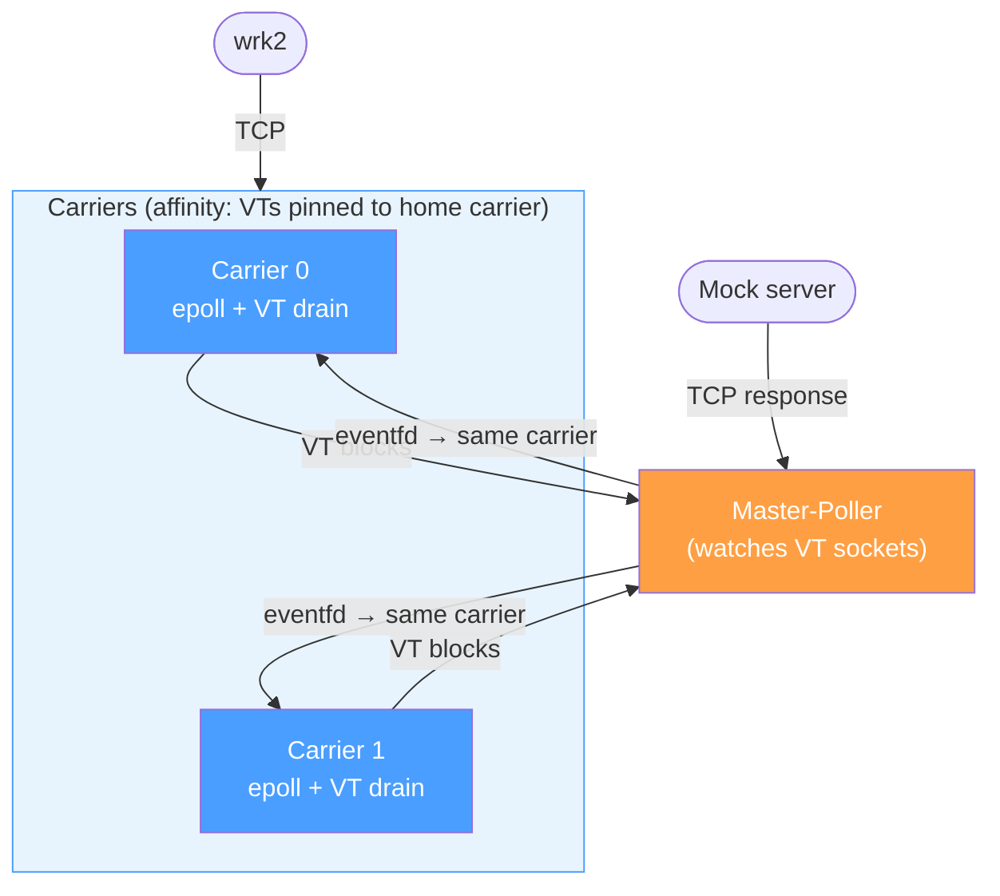

VTs have **carrier affinity**: a VT started on Carrier 0 always returns to Carrier 0.

**FJP (ForkJoinPool)** — Netty event loops run on dedicated platform threads (I/O only).
VTs run on separate FJP worker threads (any worker, no affinity). With 2 event loops,
the process has 5 threads: 2 event loops + 2 FJP workers + 1 Master-Poller.

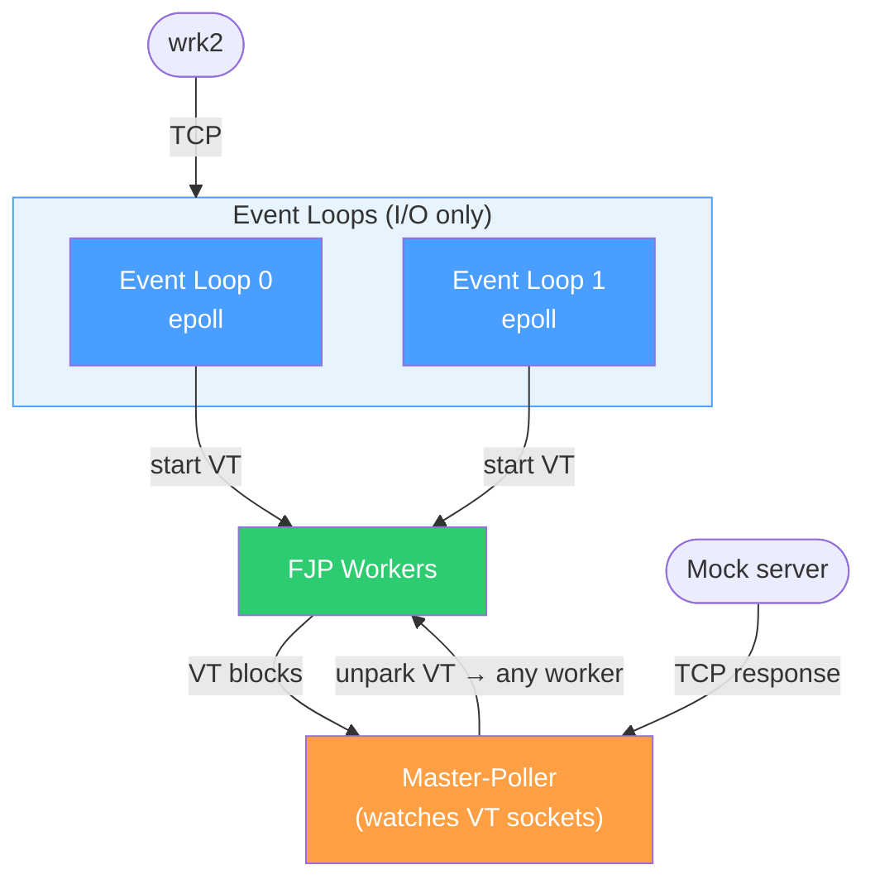

VTs **flow** to any available worker. FJP always does work stealing — preempting
one worker doesn't stall work, another steals it. See
[work-stealing design](project_workstealing_design.md) for how our scheduler
differs (opt-in, carrier-local).

### Benchmark

The benchmark: a Netty HTTP server making blocking calls to a mock backend. wrk2
generates load at a fixed rate with coordinated-omission correction. All components
are CPU-pinned to prevent cross-NUMA interference.

- **CPU-bound:** 2 carriers on CPUs 2,3; 1ms mock delay; 100 connections
- **I/O-bound:** 8 carriers on CPUs 2-9; 30ms mock delay; 10K connections
- **Test environment:** AMD Ryzen 9 7950X, Linux 7.0.9 (EEVDF), OpenJDK 27-internal
  ([loom/fibers](https://github.com/openjdk/loom/tree/fibers) at `dc6f316e036`), epoll

All measurements use `benchmark-runner/scripts/run-benchmark.sh`. CPU utilization
in tables = `task-clock / measurement-window` from `perf stat` (`--perf-stat` flag).

## The problem: 3x latency gap on CPU-bound

We measure at 50K req/s — a fixed rate below saturation where the scheduler's
responsiveness (how it interleaves I/O polling and VT draining) directly affects
latency SLAs. Our scheduler peaks at ~72K TPS (with or without work stealing),
so 50K is 70% of max. FJP peaks at 61K, so 50K is 82% of its max — closer to
its ceiling.

At this rate, our scheduler's p50 is 3.80ms. FJP achieves 1.20ms — despite having
less headroom. Same application, same requests. Pinning each carrier to its own
core (no code changes) drops our p50 to 1.16ms — better than FJP.

The latency distributions show the gap across all percentiles:

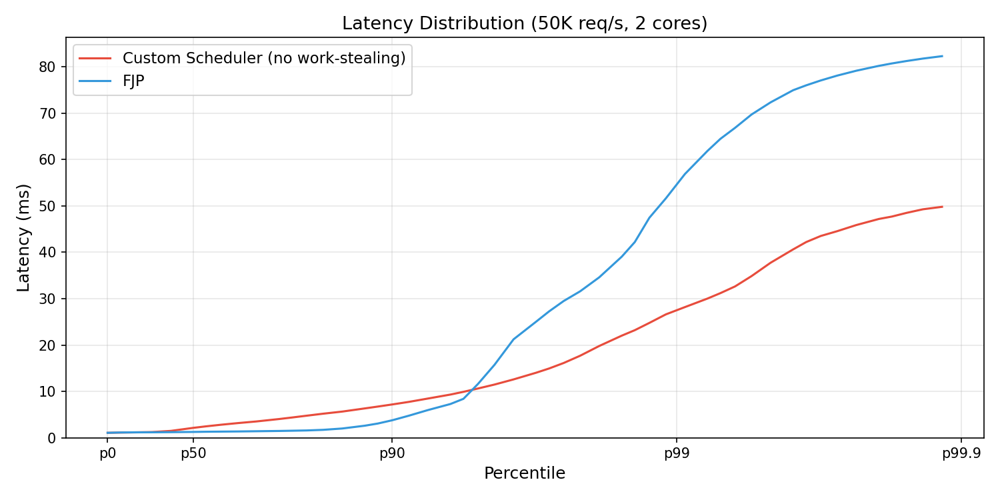

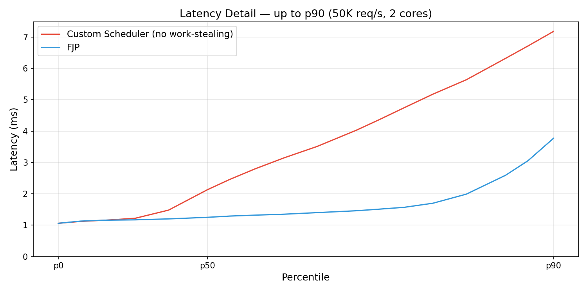


## What the tools reveal

Making each carrier CPU-affine (one carrier per core, via [`taskset`](https://man7.org/linux/man-pages/man1/taskset.1.html))
drops p50 from **3.80ms to 1.16ms**, with no code changes — better than FJP:

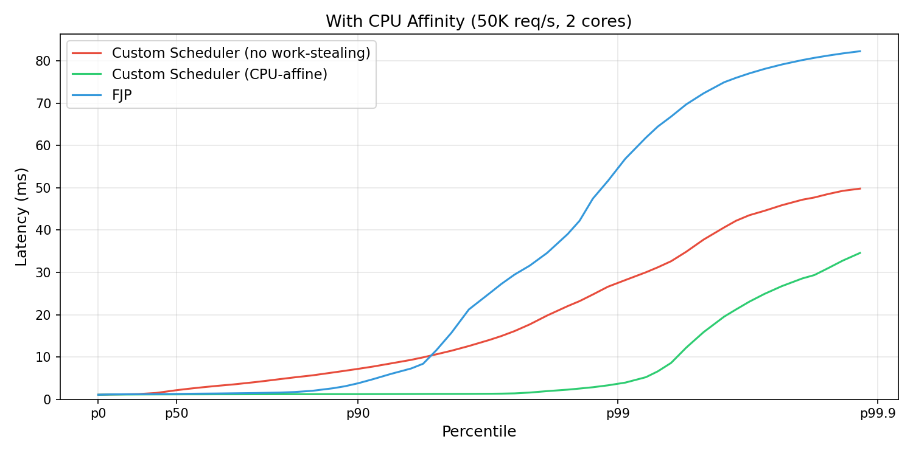

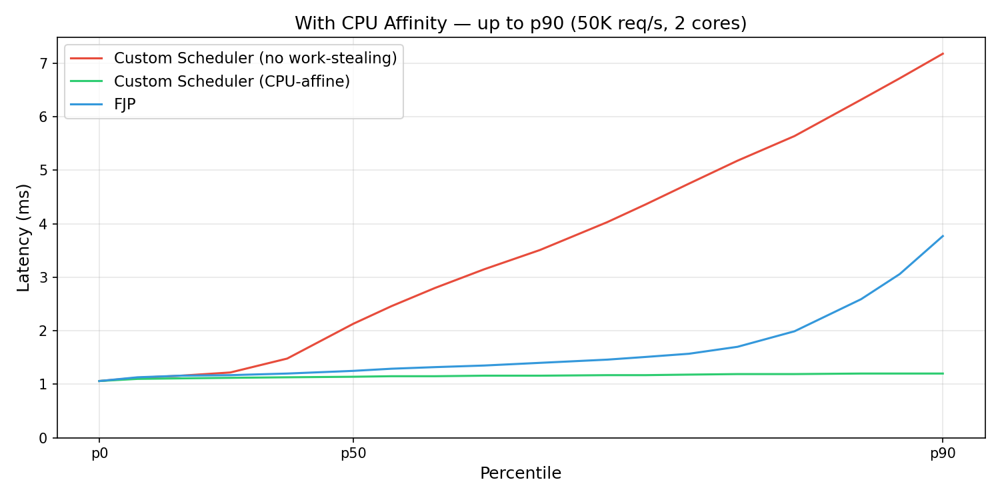

What changes?

The benchmark script collects JFR events (`--jfr`) that trace the scheduler's
internal decisions: I/O poll cycles, VT drain batches, queue depths, and VT
submission timing (see [`benchmark-runner/scripts/jfr/`](benchmark-runner/scripts/jfr/)
for event definitions). Each carrier repeatedly cycles between two phases:

1. **I/O poll** (`NettyRunIo`) — call `epoll_wait`, handle Netty I/O
   (reads, writes, accepts) for ready sockets
2. **VT drain** (`VirtualThreadTaskRuns`) — run queued virtual thread continuations:
   newly started VTs (from incoming HTTP requests) and resumed VTs (unparked by the
   carrier's sub-poller when the mock server responds)

An **IO cycle** is one iteration of this poll-drain loop. **IO events/cycle** is how
many sockets were ready in a single poll. **Runnable VT queue depth** is how many VT
continuations were queued when the carrier starts the drain phase — the batch that
accumulated while the carrier was polling or preempted.

Comparing unpinned vs pinned:

| Metric | Unpinned | Pinned |
|---|---|---|
| IO cycles/10s | 247K | 632K (2.6x) |
| IO events/cycle | 4.0 | 1.6 |
| Runnable VT queue depth (avg) | 8 | 1 |

With pinning, carriers cycle 2.6x more often. Each poll discovers fewer events (1.6 vs
4.0) and the VT queue is nearly empty (depth 1 vs 8). The carrier reacts to each event
promptly instead of finding accumulated batches.

### Linux scheduler profiling data (`--perf-sched`)

The `--perf-sched` flag uses Linux [`perf sched record`](https://man7.org/linux/man-pages/man1/perf-sched.1.html),
which traces kernel `sched_switch` and `sched_migrate_task` tracepoints — every context
switch and thread migration the kernel performs. This is the most detailed but also the
heaviest tracing option; for lower-overhead alternatives, `pidstat` (on by default) shows
per-thread `%wait` and context switch rates, and `--wakeup-trace` uses bpftrace sampling.
The benchmark script post-processes perf sched data into `perf-sched-distribution.txt`,
showing how many scheduling events each thread had on each CPU core:

The server process is confined to CPUs 2 and 3 via `taskset`. Each percentage
shows how many times each thread was scheduled to run on each core:

```
DEFAULT:                                CPU-AFFINE:
                CPU 2    CPU 3                       CPU 2    CPU 3
Thread-0        44%      56%           Thread-0      100%     —
Thread-1        55%      45%           Thread-1      —        100%
Master-Poller   53%      47%           Master-Poller 52%      48%
```

Thread-0 and Thread-1 are the two carriers; Master-Poller is the JDK I/O poller
(see [The setup](#the-setup)).

Without CPU affinity, the Linux scheduler (on this kernel,
[EEVDF](https://docs.kernel.org/scheduler/sched-eevdf.html)) spreads carriers
across both cores. The Master-Poller has more scheduling events than either carrier,
competing for CPU on both.

[`pidstat`](https://man7.org/linux/man-pages/man1/pidstat.1.html) (enabled by default,
output in `pidstat.log`) shows the `%wait` column — time the thread was runnable but
waiting for a CPU:

```
DEFAULT:                        CPU-AFFINE:
          %wait   Command                 %wait   Command
Thread-0  11.00   |__Thread-0   Thread-0   2.00   |__Thread-0
Thread-1  11.00   |__Thread-1   Thread-1   2.00   |__Thread-1
```

`%wait` is the time a thread was runnable but waiting for a CPU. Without CPU
affinity: 11%. With CPU affinity: 2%.

With CPU affinity: zero migrations, carriers cycle 3.5x faster.

### The mechanism: batching from preemption

**When a carrier is preempted, events accumulate.** When it resumes, it finds a batch.
Batches are self-reinforcing (**platoon effect**): N requests depart together,
N responses return together ~1ms later, the next poll finds ~N events again.

At constant throughput, latency is driven by **how often** the carrier polls, not
how fast each poll runs. Preemption reduces poll frequency → larger batches →
higher latency.

## "You should never block the event loop"

The old adage holds. The solutions all aim to keep carriers responsive:

- **Per-carrier CPU affinity** — bind each carrier to a dedicated core via
  [`taskset`](https://man7.org/linux/man-pages/man1/taskset.1.html). This naturally
  fits our scheduler's architecture: each carrier already has its own event loop and
  VT queue, so pinning it to a core eliminates migration and keeps caches hot.
  Common practice in HFT systems where deterministic latency matters.

- **Work stealing** — the scheduler's work stealing is conservative by default:
  it only steals when a sibling's queue is clearly overloaded. But it can be tuned
  to be more aggressive. If one carrier is descheduled while another is still running,
  the running carrier can drain work that the descheduled one left behind. See
  [work-stealing design](project_workstealing_design.md) for the tuning knobs.

- **N+1 cores** — dedicate one extra core beyond the carrier count. The extra core
  absorbs the Master-Poller, JIT compiler, and GC threads, preventing them from
  preempting carriers. This avoids the delayed and batched notifications that
  decrease responsiveness.

Latency distributions with each solution applied (FJP shown for reference):

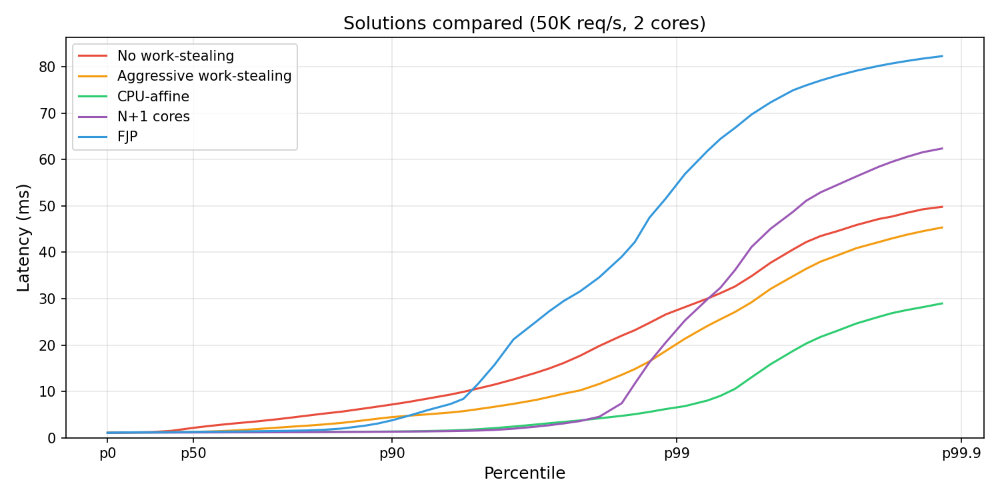

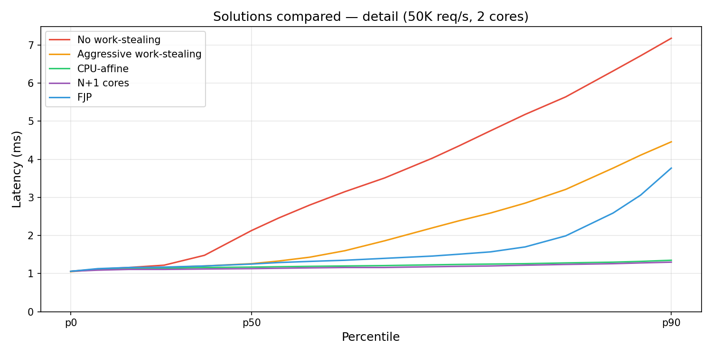

Dropping the no-work-stealing baseline to appreciate the differences among contenders:

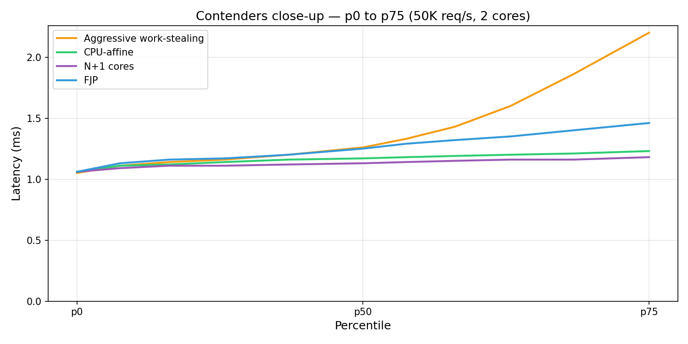

## Peak throughput

All our scheduler variants maintain ~72K max TPS. FJP peaks at ~61K — 15% lower:

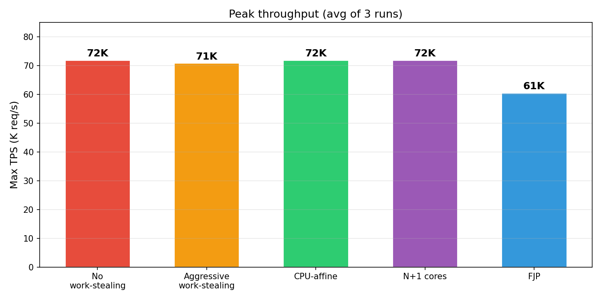

## No free lunch

Better latency costs more CPU. Each solution trades CPU headroom for responsiveness:

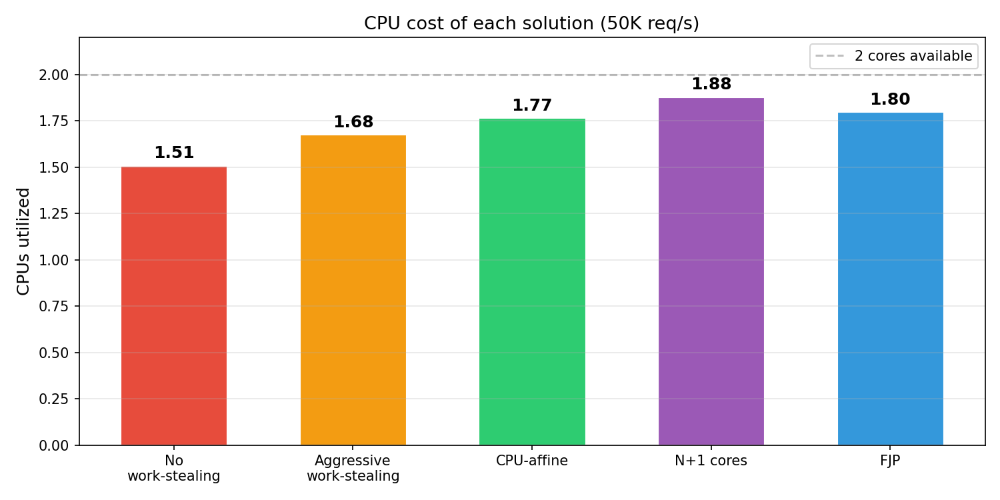


## Why FJP isn't affected

FJP runs 5 threads on 2 CPUs: 2 Netty event loops + 2 FJP workers + 1 Master-Poller.
Our scheduler runs 3 (2 carriers + Master-Poller).

FJP is **preemption-resilient by default**: preempting one worker doesn't stall
requests — another worker steals them. Preemption delays the THREAD but not the WORK.
In our scheduler without work stealing, preempting a carrier stalls its entire queue of runnable virtual threads. With work stealing enabled, a sibling carrier can steal queued work — providing
similar resilience, but opt-in rather than built-in.

FJP workers show 31% `%wait` (worse than the custom scheduler's 11%), but it doesn't
matter — work flows to whichever worker gets CPU next. The custom scheduler's carrier
`%wait` directly stalls requests because work has carrier affinity.

**FJP's trade-off:** 15% lower max TPS (61K vs 72K). `perf stat` (`--perf-stat`)
at 50K req/s, baseline (no work-stealing, no CPU affinity) vs FJP:

| Metric | Our scheduler (baseline) | FJP |
|---|---|---|
| CPUs utilized | 1.51 | 1.80 (+19%) |
| Instructions | 98.0B | 97.6B |
| Cycles | 62.1B | 69.1B (+11%) |
| IPC | 1.6 | 1.4 |
| Context switches/s | 9,207 | 28,169 (3x) |

Same instructions, more cycles, lower IPC, more CPU. FJP doesn't do more useful
work — it executes the same instructions less efficiently. The extra CPU
correlates with 3x more context switches (5 threads on 2 cores).

## Important note for the reader

What we have observed so far is a relevant artifact of the CPU-bound test scenario,
where the RTT against the external system is so small (1ms) that scheduling
micro-bursts and preemption accidents matter. This is where the different approaches
to the scheduling problem — the default Loom scheduler (FJP) vs this custom
scheduler — diverge.

For I/O-bound scenarios (30ms mock delay, 8 carriers), this does not apply:

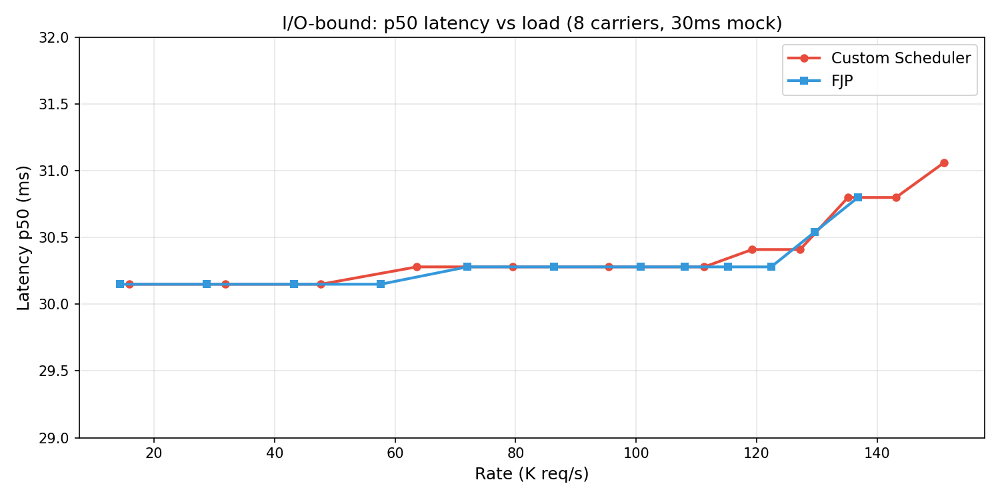

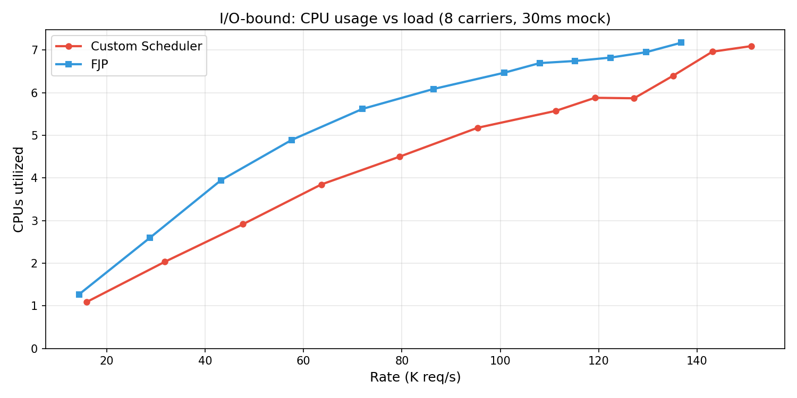

Both schedulers track each other on latency — p50 is dominated by the mock delay
(~30ms).

<p align="center">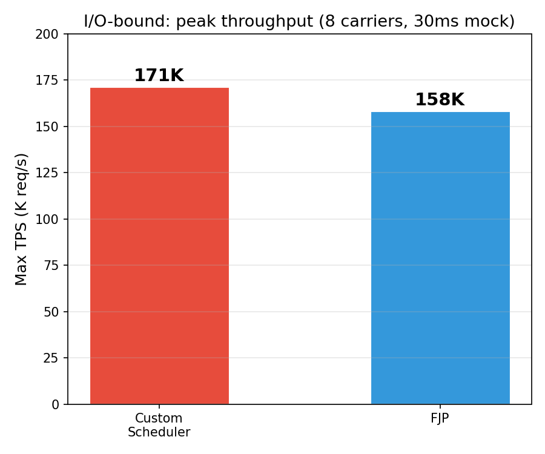</p>

## Reproducing

All data collected via [`benchmark-runner/scripts/run-benchmark.sh`](benchmark-runner/scripts/run-benchmark.sh).
See [`benchmark-runner/README.md`](benchmark-runner/README.md) for the full list of
flags and output files. See also [`run-quick-comparison.sh`](run-quick-comparison.sh) for
a self-contained script that runs all configurations back-to-back.

### CPU-bound configuration (50K req/s, 2 cores)

```bash
export JAVA_HOME=/path/to/loom/jdk

# Baseline (no WS, no affinity):
bash benchmark-runner/scripts/run-benchmark.sh \
  --mode NETTY_SCHEDULER --io epoll --threads 2 --rate 50000 \
  --connections 100 --load-threads 4 --load-cpuset 0,1,4,5 \
  --server-cpuset 2,3 --mock-cpuset 6,7 --mock-threads 2 --mock-think-time 1 \
  --perf-stat --output-dir results/baseline

# Aggressive work-stealing:
SERVER_WS=true \
bash benchmark-runner/scripts/run-benchmark.sh \
  --mode NETTY_SCHEDULER --io epoll --threads 2 --rate 50000 \
  --connections 100 --load-threads 4 --load-cpuset 0,1,4,5 \
  --server-cpuset 2,3 --mock-cpuset 6,7 --mock-threads 2 --mock-think-time 1 \
  --perf-stat --output-dir results/ws-aggressive

# Work-stealing + topology (CPU-affine carriers):
SERVER_WS=true SERVER_TOPOLOGY=true \
bash benchmark-runner/scripts/run-benchmark.sh \
  --mode NETTY_SCHEDULER --io epoll --threads 2 --rate 50000 \
  --connections 100 --load-threads 4 --load-cpuset 0,1,4,5 \
  --server-cpuset 2,3 --mock-cpuset 6,7 --mock-threads 2 --mock-think-time 1 \
  --perf-stat --output-dir results/ws-topo

# N+1 cores (3 cores for 2 carriers):
bash benchmark-runner/scripts/run-benchmark.sh \
  --mode NETTY_SCHEDULER --io epoll --threads 2 --rate 50000 \
  --connections 100 --load-threads 4 --load-cpuset 0,1,4,5 \
  --server-cpuset 2,3,8 --mock-cpuset 6,7 --mock-threads 2 --mock-think-time 1 \
  --perf-stat --output-dir results/n-plus-1

# FJP (reference):
bash benchmark-runner/scripts/run-benchmark.sh \
  --mode NON_VIRTUAL_NETTY --io epoll --threads 2 --rate 50000 \
  --connections 100 --load-threads 4 --load-cpuset 0,1,4,5 \
  --server-cpuset 2,3 --mock-cpuset 6,7 --mock-threads 2 --mock-think-time 1 \
  --perf-stat --output-dir results/fjp
```

### I/O-bound configuration (max TPS, 8 cores)

```bash
bash benchmark-runner/scripts/run-benchmark.sh \
  --mode NETTY_SCHEDULER --io epoll --threads 8 \
  --connections 10000 --load-threads 4 --load-cpuset 0,1,2,3 \
  --server-cpuset 8,9,10,11,12,13,14,15 --mock-cpuset 4,5,6,7 \
  --mock-threads 4 --mock-think-time 30 \
  --perf-stat --output-dir results/io-bound
```

### Important notes

- **Heap:** default `-Xms1g -Xmx1g` (via `JAVA_OPTS`).
- **JFR:** do NOT enable `--jfr` for latency comparison — JFR event overhead
  inflates p50 by 2-3x on 2 cores. Use JFR only in separate runs for event analysis.
- **Clean builds:** always `mvn clean package -DskipTests` when switching branches or
  commits — stale classes in the fat jar produce silently wrong results.
- **Load gen sizing:** 4 threads on 4 CPUs for the load generator is required at 50K
  rate. With fewer threads/cores, wrk2 becomes the bottleneck and all latency numbers
  are inflated.

### Key flags

- `--perf-stat` — CPU utilization via `perf stat`
- `--perf-sched` — Linux scheduler profiling (thread CPU distribution, migrations)
- `--jfr` — Netty scheduler JFR events (use only for event counts, not latency)
- `--mode NETTY_SCHEDULER` / `--mode NON_VIRTUAL_NETTY` — our scheduler vs FJP
- `SERVER_WS=true` — enable work stealing
- `SERVER_TOPOLOGY=true` — enable LinuxCarrierTopology (CPU pinning + cluster awareness)
