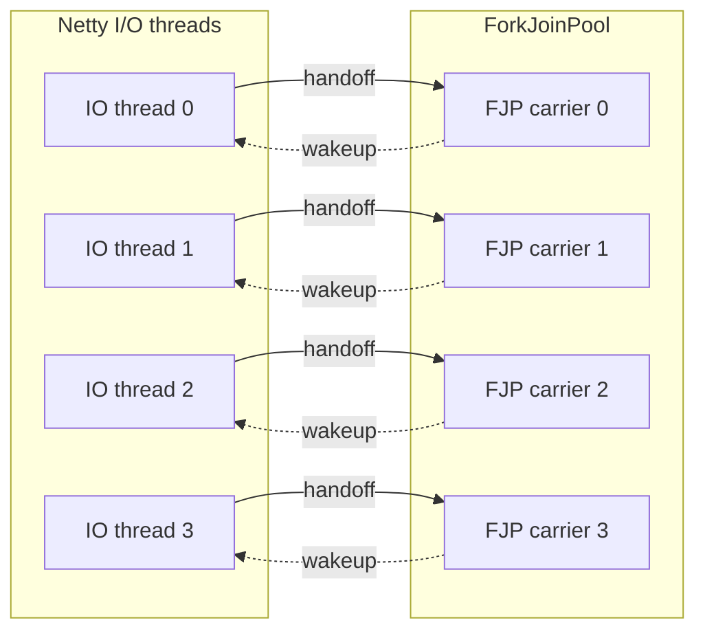
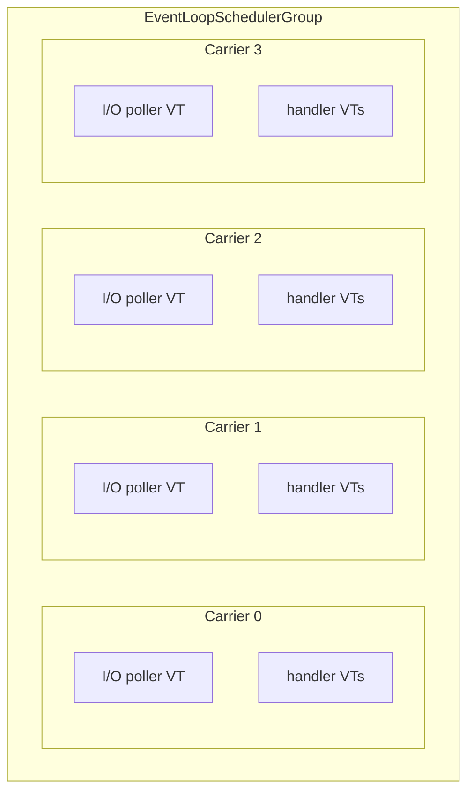
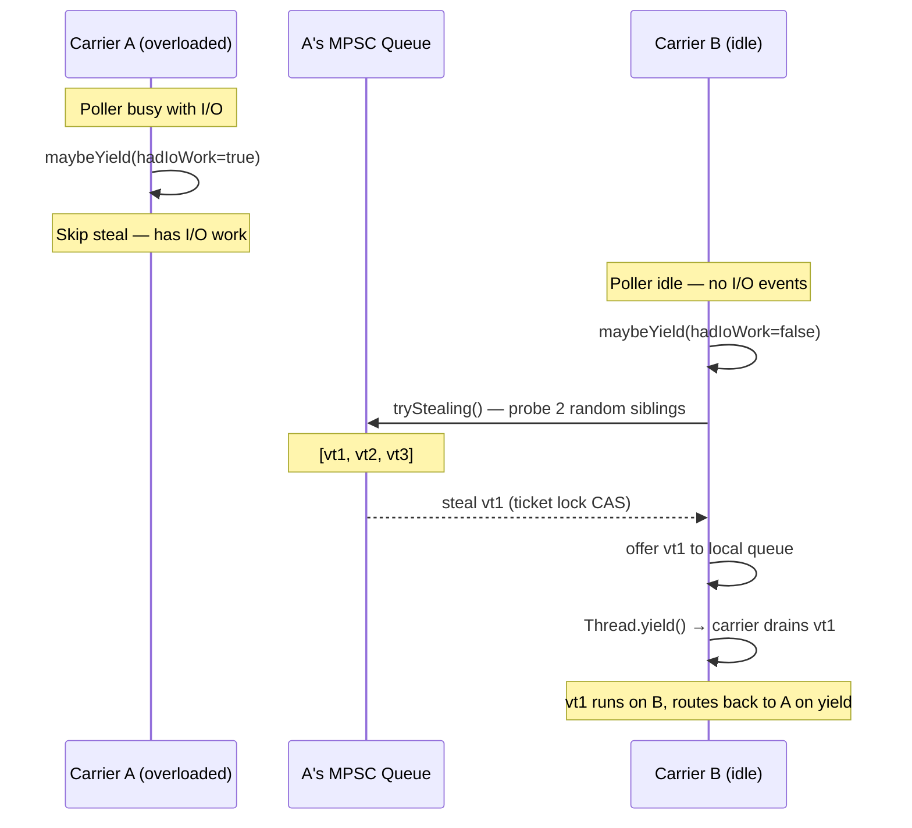

# Netty VirtualThread Scheduler

A locality-first virtual thread scheduler for the JVM. Virtual threads that work together run on the same carrier thread, reducing context switches and improving cache locality.

## Why

**You want locality.** The default ForkJoinPool scatters virtual threads across carriers randomly. When a Netty handler spawns a VT for blocking work, it runs on a different thread; when it posts back, that's a wakeup and a cache miss. This scheduler keeps related work on the same carrier — fewer context switches, better cache hit rates, less CPU wasted on handoffs. See [Netty with NIO](#netty-with-nio) or [without Netty](#locality-first-scheduling-without-netty).

**You need native transports.** Kernel I/O calls (epoll_wait, io_uring_enter) pin the virtual thread to its carrier. On ForkJoinPool, each native poller permanently occupies a shared carrier thread. This scheduler gives each native poller its own dedicated carrier, so pinning doesn't starve the rest of the system. See [Netty with native transport](#netty-with-native-transport-epoll--io_uring).

**You want control.** The scheduler exposes a simple API to register your own I/O pollers, get per-carrier thread factories, and decide exactly which virtual threads share a carrier. No black-box scheduling decisions — you control the topology. See [writing a custom pinned poller](#writing-a-custom-pinned-poller).

**This scheduler doesn't replace ForkJoinPool** — it runs alongside it. `Thread.ofVirtual()` still creates virtual threads on the default FJP, and third-party libraries that create their own virtual threads are unaffected. You choose which work runs on which scheduler:

```java
var group = new VirtualIoNativePollerEventLoopGroup(EpollIoHandler.newFactory());
var schedulerFactory = group.vThreadFactory();

schedulerFactory.newThread(() -> {
    // scope with our factory → forked tasks stay on the same carrier
    try (var scope = StructuredTaskScope.open(allSuccessfulOrThrow(),
            cf -> cf.withThreadFactory(schedulerFactory))) {
        scope.fork(() -> fetchFromCache());
        scope.join();
    }

    // scope without factory → forked tasks run on default FJP
    try (var scope = StructuredTaskScope.open(allSuccessfulOrThrow())) {
        scope.fork(() -> callThirdPartyLibrary());
        scope.join();
    }
}).start();
```

**Split topology (default)** — 8 OS threads for 4 cores, every arrow is a handoff:



**Unified topology (this scheduler)** — 4 OS threads, no cross-pool handoffs:



This scheduler runs I/O and virtual threads on the same carrier threads. No oversubscription, no cross-pool handoffs, and native pollers get their own dedicated carrier.

For the full analysis with benchmarks, see the [talk at Devoxx](https://youtu.be/Oy005l5vHtE?si=5epV66hc6PTPdDSB) and [slides](https://speakerdeck.com/franz1981/reactive-loom-a-forbidden-love-story).

## What it provides

1. **A carrier-affinity scheduler** (`EventLoopSchedulerGroup`) — a global pool of permanent carrier threads, each with its own MPSC queue. Virtual threads created from a carrier's factory have affinity to that carrier.
2. **Netty integration** — drop-in event loop groups that run Netty I/O on the scheduler's carriers, so handler-spawned virtual threads stay on the same carrier as the event loop that received the request.

## Quick guide

| Transport | Class | Pinned poller? |
|---|---|---|
| NIO | `VirtualIoNioPollerEventLoopGroup` | Yes — priority poller, anti-steal; NIO parks via Loom (carrier freed) |
| EPOLL / IO_URING | `VirtualIoNativePollerEventLoopGroup` | Yes — one per carrier, kernel I/O pins carrier |
| NIO (lightweight) | `VirtualIoEventLoopGroup` | No — event loop as regular VT, no anti-steal |
| No Netty | `EventLoopSchedulerGroup` | Optional — `registerPinnedPoller()` |

## Architecture

```
EventLoopSchedulerGroup (global singleton, N carriers)
 ├── EventLoopScheduler[0]
 │    ├── carrier thread (permanent, daemon)
 │    ├── MPSC run queue
 │    └── virtualThreadFactory() → VTs with affinity to this carrier
 ├── EventLoopScheduler[1]
 │    └── ...
 └── EventLoopScheduler[N-1]
```

**Carrier threads** run forever (like ForkJoinPool workers). They drain the run queue and execute virtual thread continuations. When idle, they park.

**Virtual threads** created via a scheduler's `virtualThreadFactory()` are scheduled on that carrier. When they block, they park (freeing the carrier); when they resume, the continuation goes back into the same carrier's run queue.

A carrier can optionally host a **pinned poller** — a long-running virtual thread dedicated to kernel I/O (epoll_wait, io_uring_enter). It runs as a VT (not directly on the carrier thread) to avoid deadlocking the carrier: all carrier-to-VT coordination goes through lock-free structures. The scheduler coordinates preemption: when external VTs have work queued, the poller yields; when nothing is pending, the poller can block in kernel I/O.

## Prerequisites

- A Loom-enabled JDK (Java 27+, [builds.shipilev.net](https://builds.shipilev.net/openjdk-jdk-loom/) or build from [openjdk/loom](https://github.com/openjdk/loom))
- JVM flag: `-Djdk.virtualThreadScheduler.implClass=io.netty.loom.spi.NettyScheduler`
- Maven 3.6+

## Usage

### Netty with NIO

Use `VirtualIoNioPollerEventLoopGroup`. NIO parks via Loom (carrier is freed), so the event loop doesn't pin the carrier. The poller registration gives the event loop priority scheduling and prevents it from being stolen when work stealing is enabled.

```java
var group = new VirtualIoNioPollerEventLoopGroup(NioIoHandler.newFactory());

new ServerBootstrap()
    .group(group)
    .channel(NioServerSocketChannel.class)
    .childHandler(/* ... */)
    .bind(8080).sync();
```

For a lightweight alternative without anti-steal guarantees, use `VirtualIoEventLoopGroup`:

```java
var group = new VirtualIoEventLoopGroup(4, NioIoHandler.newFactory());
```

### Netty with native transport (EPOLL / IO_URING)

Use `VirtualIoNativePollerEventLoopGroup`. It registers a pinned poller on each carrier — a virtual thread that runs the Netty event loop and does kernel I/O (epoll_wait, io_uring_enter) with affinity to that carrier.

```java
var group = new VirtualIoNativePollerEventLoopGroup(EpollIoHandler.newFactory());

new ServerBootstrap()
    .group(group)
    .channel(EpollServerSocketChannel.class)
    .childHandler(new ChannelInitializer<SocketChannel>() {
        @Override
        protected void initChannel(SocketChannel ch) {
            ch.pipeline().addLast(new MyHandler(group));
        }
    })
    .bind(8080).sync();
```

Spawn virtual threads from a handler — they run on the same carrier as the event loop:

```java
class MyHandler extends SimpleChannelInboundHandler<FullHttpRequest> {
    private final VirtualIoNativePollerEventLoopGroup group;

    @Override
    protected void channelRead0(ChannelHandlerContext ctx, FullHttpRequest req) {
        group.vThreadFactory().newThread(() -> {
            // blocking work here — same carrier as the event loop
            byte[] result = blockingHttpCall();
            ctx.channel().eventLoop().execute(() -> writeResponse(ctx, result));
        }).start();
    }
}
```

### Locality-first scheduling without Netty

Use the scheduler directly. No Netty dependency needed — just the core module.

```java
var group = EventLoopSchedulerGroup.instance();
var scheduler = group.scheduler(0);

// all VTs from this factory have affinity to carrier 0
ThreadFactory tf = scheduler.virtualThreadFactory();
tf.newThread(() -> {
    // runs on carrier 0
    doWork();
}).start();
```

Round-robin across all carriers:

```java
var group = EventLoopSchedulerGroup.instance();
for (int i = 0; i < tasks; i++) {
    var scheduler = group.scheduler(i % group.size());
    scheduler.virtualThreadFactory().newThread(() -> doWork()).start();
}
```

### Writing a custom pinned poller

Register your own I/O poller on a carrier via `registerPinnedPoller`. The poller runs as a virtual thread with affinity to the carrier (not directly on the carrier thread — this avoids deadlocks by keeping all coordination lock-free). The returned `CompletionStage` completes when the poller exits and the slot is freed.

```java
var scheduler = EventLoopSchedulerGroup.instance().scheduler(0);

CompletionStage<Void> termination = scheduler.registerPinnedPoller(
    () -> false,  // spinning — never sleeps, must return false (see below)
    () -> {
        while (!shutdown) {
            int events = doPollNonBlocking();
            scheduler.maybeYield(events > 0);  // report I/O activity
            processTasks();
            scheduler.maybeYield(events > 0);
        }
    }
);
```

That's the simplest correct poller — non-blocking poll, yield between phases, no wakeup coordination needed. The scheduler handles the rest.

A pinned poller has three responsibilities:

1. **Yield CPU time and report I/O activity.** Call `maybeYield(hadIoWork)` between phases. The boolean argument tells the scheduler whether the poller processed I/O events since the last call:

   - **`hadIoWork=true`**: the poller has I/O to process. The scheduler only yields for local VT preemption — no work stealing, because the carrier is doing useful work.
   - **`hadIoWork=false`**: the poller is idle. The scheduler may attempt to steal work from an overloaded sibling (if [work stealing](#work-stealing-experimental) is enabled), helping reduce tail latency when load is uneven.

   The scheduler heartbeat is always updated on every `maybeYield` call regardless of `hadIoWork`. What `hadIoWork` controls is the **steal path**: when `false`, the scheduler may steal from an overloaded sibling; when `true`, stealing is suppressed because the carrier is doing useful I/O work. Passing `true` incorrectly would prevent the carrier from ever stealing, while passing `false` incorrectly would make the carrier steal when it should be doing I/O. **Get this right** — it's the feedback loop between the poller and the scheduler.

2. **Terminate.** The poller slot is freed when the body `Runnable` returns (via try-finally internally). The returned `CompletionStage` completes after cleanup, so callers can wait for the slot to be available again.

3. **Report wakeup state honestly.** The wakeup `BooleanSupplier` must return `true` if the poller was observed sleeping (blocking in kernel I/O) and the wakeup signal was sent, or `false` if the poller was actively running (spinning, processing events). The scheduler uses this to decide whether idle siblings need to be woken for work stealing — a poller that falsely reports "sleeping" when it's actually running can suppress sibling wakeups that would otherwise help an overloaded carrier.

   - **Non-blocking poller (spin-poll):** return `false` — the poller never sleeps, so waking it doesn't free the carrier. An active poller calls `maybeYield(false)` on every cycle, which already probes siblings for work to steal — there is no need to wake it.
   - **Blocking poller (native transport):** track whether you're inside the blocking syscall (e.g. a volatile flag set before `epoll_wait()` and cleared after). Return `true` and send the wakeup signal when the flag is set — this tells the scheduler that waking the poller freed the pinned carrier, so no sibling help is needed. Return `false` when the poller is actively running.
   - **Loom-friendly poller (NIO):** return `false` — NIO's `select()` parks via Loom, freeing the carrier. The carrier parks in its scheduler loop and is woken via `LockSupport.unpark()`, not via the poller wakeup. See `VirtualIoNioPollerEventLoopGroup`.

4. **Never miss a wakeup — if you choose to block.** The simple poller above never blocks, so it doesn't need wakeup coordination. But if you want to block in kernel I/O when idle (to save CPU), the blocking path introduces a coordination problem.

   The blocking decision must be made **inside your transport** — the transport must advertise it's about to sleep (store a flag) before checking `canBlock()` (a load), with a StoreLoad barrier between the two so the load cannot slip before the advertisement. This is the [Seastar sleep/wakeup pattern](https://www.scylladb.com/2018/02/15/memory-barriers-seastar-linux/): the symmetric store-barrier-load on both producer and consumer sides ensures at least one side always sees the other's store.

   This is how the native transport integration works: `canBlock()` is [injected into the ManualIoEventLoop](core/src/main/java/io/netty/loom/VirtualIoNativePollerEventLoopGroup.java) via override, the transport advertises sleep via a volatile write (`pollerRunning.set(false)`) before reading `canBlock()`, and the wakeup checks that flag to report whether the poller was sleeping (see [netty#15922](https://github.com/netty/netty/issues/15922)):

   ```java
   // inject canBlock into the transport
   var eventLoop = new ManualIoEventLoop(parent, null, handlerFactory) {
       @Override
       public boolean canBlock() {
           return scheduler.canBlock();
       }
   };

   scheduler.registerPinnedPoller(
       () -> {              // wakeup: return true if poller was sleeping
           if (!pollerRunning.get()) {
               eventLoop.wakeup();
               return true;
           }
           return false;
       },
       () -> {
           boolean canBlock = false;
           while (!eventLoop.isShuttingDown()) {
               int events = canBlock
                   ? eventLoop.run(MAX_WAIT_NS, YIELD_NS)
                   : eventLoop.runNow(YIELD_NS);
               boolean hadVtWork = scheduler.maybeYield(events > 0);
               canBlock = events == 0 && !hadVtWork;
           }
       }
   );
   ```

   Between `canBlock()` returning true and the transport entering its blocking syscall, work may arrive and the scheduler calls `wakeup()`. That signal must not be lost. Two approaches:

   **Permit-based (lock-free):** The transport's wakeup is sticky — if called before the blocking call starts, the blocking call returns immediately. Examples: `eventfd` (stays readable until consumed), `Selector.wakeup()` (sets a flag), `LockSupport.unpark()` (stores a permit). This is what Netty's transports use.

   **Lock-based (rendezvous):** The `canBlock()` check and the blocking wait happen inside a lock shared with `wakeup()`. The signal cannot slip between the check and the wait. Note: `Condition.signal()` is **not** sticky — if it arrives before `Condition.await()`, it's lost. The queue-empty check must be inside the locked region.

   For background on why this coordination is subtle, see:
   - [Seastar's memory barrier approach](https://www.scylladb.com/2018/02/15/memory-barriers-seastar-linux/) — the symmetric store-barrier-load pattern between producer and consumer
   - [Mechanical-sympathy discussion](https://groups.google.com/g/mechanical-sympathy/c/yKQNVFAjui0/m/NAhfyjT-BAAJ) — why `Condition.signal()` deadlocks when it arrives before `Condition.await()`, and why permit-based mechanisms (`LockSupport.park`/`unpark`) don't have this problem
   - [Viktor Klang's actor](https://gist.github.com/viktorklang/2557678) — the atomic-flag-with-recheck pattern

Additional constraints:
- `canBlock()` is a snapshot — it can go stale immediately. Never cache the result.
- One poller per carrier. `registerPinnedPoller` throws if a poller is already registered.

For a deeper look at the store-barrier-load protocol, JCStress proofs that the guard prevents missed wakeups (and that removing it causes 94% signal loss), and the [`BlockingPollGuard`](concurrency-tests/src/main/java/io/netty/loom/concurrent/BlockingPollGuard.java) utility that encapsulates it, see [`concurrency-tests/README.md`](concurrency-tests/README.md).

## Configuration

| Property | Default | Description |
|---|---|---|
| `io.netty.loom.schedulers` | `availableProcessors()` | Number of carrier threads |
| `io.netty.loom.yield.us` | `50` | Yield duration in microseconds |
| `io.netty.loom.idleSpins` | `0` | Idle spin iterations before blocking. When >0, the poller spins this many iterations (calling `Thread.onSpinWait()`) before entering the blocking I/O path. Prevents batch formation at the cost of higher CPU usage below saturation. **The effective spin duration depends on the transport:** each iteration includes a non-blocking I/O poll — measured at ~0.42µs for epoll (syscall) and ~0.05µs for io_uring (shared-memory CQ peek) under continuous spinning. So 256 spins ≈ 108µs with epoll but only ~13µs with io_uring. The same spin count is not interchangeable across transports. |
| `io.netty.loom.resumed.continuations` | `1024` | Initial MPSC queue capacity |
| `io.netty.loom.workstealing.enabled` | `false` | Enable work stealing (experimental) |
| `io.netty.loom.workstealing.unresponsive.ms` | `200` | Time without a scheduling checkpoint before a carrier is considered unresponsive |
| `io.netty.loom.workstealing.wake.queue` | `8` | Queue depth above which `execute()` wakes an idle sibling via eventfd. Higher = fewer wakeup syscalls but slower reaction to imbalance. |
| `io.netty.loom.workstealing.steal.queue` | `2` | Queue depth above which an already-awake carrier considers a sibling worth stealing from. Lower = more aggressive load balancing at no syscall cost. |

## Work stealing (experimental)

Work stealing allows idle carriers to help overloaded siblings by taking virtual
threads from their run queues. It is **opt-in** and designed around a
**locality-first** principle.

Enable with `-Dio.netty.loom.workstealing.enabled=true`.

### Steal vs wake thresholds

Two separate queue depth thresholds control different decisions with different costs:

- **`steal.queue` (default 2):** used by `tryStealing()` when an already-awake carrier
  probes siblings for work. This is cheap — just a queue size check, no syscall. A low
  threshold means idle carriers steal aggressively, improving load balancing.
- **`wake.queue` (default 8):** used by `execute()` to decide whether to call
  `wakeIdleSibling()`. This is expensive — it writes to an eventfd to wake a sleeping
  carrier. A higher threshold avoids unnecessary wakeup syscalls while still reacting
  to sustained overload.

The asymmetry reflects the cost difference: probing is free (the stealer is already
running), waking requires a syscall.

### Locality-first principle

Each virtual thread has a **home carrier** — the carrier whose factory created it.
The VT's I/O (sockets, channels) is registered on the home carrier's event loop.
Running the VT on its home carrier means I/O completions arrive on the same carrier
with no cross-carrier wakeups, no cache misses, and no eventfd writes.

**Stealing violates locality.** A stolen VT runs on a foreign carrier. When it
completes and calls `channel.writeAndFlush()`, the write goes to the home carrier's
event loop task queue — a cross-carrier hop. When the VT yields or blocks, its
continuation routes back to the home carrier's MPSC queue (non-sticky stealing).

This is why stealing is **reluctant**:
- Only steal from carriers that are genuinely not making progress (unresponsive >200ms
  or queue depth >10) — never from a carrier that's actively draining its own work.
- Only steal when idle (no local VTs, no I/O work) — never interrupt useful work to
  help a sibling.
- Power-of-2 random probing — O(1), no scan, minimal sibling interaction on the hot path.

The design is **topology-ready**: when CPU topology awareness is added (NUMA nodes,
LLC groups), the siblings array can be ordered by proximity. `tryStealing()` and
`wakeIdleSibling()` would naturally prefer nearby carriers — steal from the closest
overloaded sibling first, wake the closest idle sibling.

This contrasts with Go and ForkJoinPool, which signal on **every** goroutine/task
creation (see [sibling wake research](#queue-order-fifo-everywhere)). Their tasks have
no home — they run anywhere with equal efficiency. Our VTs have carrier affinity,
so aggressive stealing would trade locality for load balance. We only trade when
the carrier genuinely cannot help itself.

### Why power-of-2 choices

Victim selection for both stealing and sibling waking uses **power-of-2 random
probing**: pick 2 random siblings, choose the better candidate. This gives
near-optimal selection with O(1) cost — no scanning, no shared data structure,
no contention between concurrent stealers.

From a scalability perspective (Neil Gunther's Universal Scalability Law), the
coherency penalty grows with the number of parties contending on shared state.
Scanning all N siblings on every steal attempt means N volatile reads per attempt
× M concurrent stealers = O(N×M) coherency traffic. With 128 carriers, this
dominates. Power-of-2 reduces it to O(1) per attempt — two reads, no shared
counter, no CAS on a central structure. ForkJoinPool avoids scanning with a
Treiber stack (O(1) CAS pop), but requires a shared atomic. Power-of-2 has
**zero shared contention** — each stealer reads two independent sibling queues.

The approach is validated by Danny Thomas's
[virtual-threads-cluster-aware](https://github.com/DanielThomas/virtual-threads-cluster-aware)
experiments on the [loom-dev mailing list](https://mail.openjdk.org/pipermail/loom-dev/2024-September/007161.html)
(September 2024). His `CHOOSE_TWO` placement strategy — power-of-2 choices for
selecting the least loaded cluster — delivered ~29% more throughput than the default
FJP scheduler while using significantly less CPU on an AMD EPYC 9R14 (CCX-clustered
L3 caches). The results demonstrate that topology-aware power-of-2 selection is a
practical, low-overhead alternative to full scanning or centralized queue structures.

### How it works



The scheduler checkpoint is `maybeYield(hadIoWork)`. The pinned poller calls it
between I/O phases and reports whether it processed events:

- **`hadIoWork=true`**: the poller has I/O to process. Only yields for local VT
  preemption. No stealing — the carrier is doing useful work.
- **`hadIoWork=false`**: the poller is idle. The scheduler checks siblings for
  stealable work via power-of-2 random probing (O(1), no scan).

A sibling qualifies as a steal victim when `needsHelp()` returns true:
- **Unresponsive with work**: no scheduling checkpoint reached in >200ms **and**
  the run queue is non-empty. The carrier is stuck running a long VT while
  other continuations wait. An unresponsive carrier with an empty queue (e.g.
  idle/parked or blocking in kernel I/O) is not a steal victim — there is
  nothing to steal.
- **Overloaded**: the run queue exceeds the threshold (default 10). A burst of VT
  submissions is piling up faster than the carrier can drain.

Stolen tasks go to the stealer's local queue. The poller yields naturally via
`hasRunnableContinuations()` and the carrier drains the stolen VT.

### What "unresponsive" means

Each carrier maintains a **scheduler heartbeat** — a nanosecond timestamp updated
via `setOpaque` at every scheduling checkpoint:

- After each VT continuation completes (in `runContinuation()`, after `task.run()` returns)
- At every `maybeYield(hadIoWork)` call (the poller's scheduling checkpoint)
- Before and after carrier park (in `virtualThreadSchedulerLoop()`)

A carrier is **unresponsive** when `System.nanoTime() - heartbeat > threshold`
(default 200ms). This means the carrier hasn't reached any scheduling checkpoint
in that time. Three cases:

- **Stuck on a long VT**: the carrier is inside `task.run()` for a VT that runs
  for >200ms without yielding. No checkpoint is reachable because the carrier
  is inside `task.run()`.
- **Blocking in kernel I/O**: the poller entered `epoll_wait` (idle, no events).
  The heartbeat was updated when the poller last called `maybeYield()`, but no
  further checkpoints occur while sleeping. After 200ms the carrier becomes
  unresponsive. Note: a blocking carrier always has an empty queue
  (`canBlock()` requires it), so nothing can be stolen FROM it. But it
  can be woken via `wakeup()` to help steal from others.
- **Poller descheduled**: the poller VT is parked on something other than I/O
  (e.g. a `CountDownLatch`). The carrier has nothing to run — no VTs, no
  pinned continuation — and tries to steal before parking. This lets a carrier
  with a registered-but-descheduled poller help an overloaded sibling.
- **Carrier parked** (no poller): the carrier touches the heartbeat immediately
  before parking and again after waking, mirroring the poller's pattern. A
  recently-parked carrier appears responsive — only after the threshold elapses
  while parked does it become unresponsive.

### Submission paths and when help is requested

Virtual thread continuations arrive in `execute()` from two sources:

**External submissions** (from a different carrier or a platform thread):
- The submitter's `runningScheduler()` differs from the target → `wakeup()` fires
  to interrupt the target's blocking I/O or unpark its carrier.
- If `wakeup()` returned false (carrier was not sleeping) and the target
  `needsHelp()` (unresponsive or overloaded) → `wakeIdleSibling()` wakes a random
  idle sibling to come steal.

**Internal submissions** (a VT running on this carrier submits to the same carrier):
- The submitter's `runningScheduler()` matches → no self-wakeup needed.
- If the carrier `needsHelp()` → `wakeIdleSibling()` still fires. This covers the
  case where a VT monopolizes a carrier and spawns many children: the carrier is
  stuck running the parent VT while children pile up in the queue. An idle sibling
  is woken to help drain them.
- Note: the poller VT counts as "internal" here — submissions from Netty handlers
  (channelRead → vThreadFactory → start) come from the poller VT, which has
  `runningScheduler() == this`. No self-wakeup fires, but `needsHelp()` is checked.

**Yield / re-enqueue** (onContinue path, runs on the carrier thread itself):
- Skipped entirely — the carrier thread is actively draining, no wakeup or help
  request needed. The carrier will pick up the re-enqueued continuation on its
  next drain cycle.

`wakeIdleSibling()` uses power-of-2 random probing: pick 2 random siblings, try
`wakeup()` on the first — if it was actually idle (poller blocking or carrier
parked), the wakeup fires and returns true. If the first was busy, try the second.
This avoids scanning all siblings (O(1) regardless of carrier count).

### Ticket lock: biased consumer coordination

The MPSC queue (jctools `MpscUnboundedArrayQueue`) is single-consumer by design.
Work stealing introduces a second consumer (the stealer). A **ticket lock**
coordinates access with asymmetric paths:

**Carrier (owner)** — `acquireConsumer()` / `releaseConsumer(ticket)`:
uses `XADD` (atomic increment) on `consumerTicket`, then spins on `consumerServing`
until its ticket is served. Wait-free in the common case (no stealer active).
When a stealer is mid-poll, the carrier spins briefly via `Thread.onSpinWait()`.

**Stealer** — `tryStealOne()`:
uses `CAS` on `consumerTicket`. If the carrier or another stealer holds the lock,
the CAS fails immediately and the stealer gives up (returns null). No spinning,
no blocking — best-effort only.

This is intentionally **biased toward the carrier**: the owner always succeeds
(XADD), the stealer gives up on contention (CAS failure). The carrier's drain
throughput is never degraded by steal attempts. An `isEmpty()` fast-path before
`acquireConsumer()` avoids the XADD entirely on empty polls.

### Queue order: FIFO everywhere

Both the carrier and the stealer consume from the same MPSC queue head (FIFO).
The oldest virtual thread continuation is processed first, regardless of whether
it's drained locally or stolen.

This differs from classical work stealing (Cilk, ForkJoinPool in compute mode):

| Runtime | Local execution | Steal order | Why |
|---------|----------------|-------------|-----|
| **Cilk / FJP (compute)** | LIFO (newest first) | FIFO (oldest first) | Cache locality: newest task has hot data in L1. Stealer takes cold oldest task — minimizes cache interference. Optimal for recursive fork-join parallelism. |
| **FJP with Loom (asyncMode)** | FIFO | FIFO | Fairness: virtual threads are I/O-bound continuations, not recursive tasks. FIFO prevents starvation of VTs waiting to resume after I/O. |
| **Go runtime** | FIFO (256-slot ring) + 1-slot LIFO (`runnext`) | FIFO | Hybrid: `runnext` gives the most recent goroutine priority (producer-consumer locality), everything else is FIFO for fairness. |
| **This scheduler** | FIFO (MPSC queue) | FIFO (same queue) | Same rationale as Loom: VTs are I/O continuations. FIFO ensures fair drain order. The MPSC queue is single-ended — no deque, no LIFO option. |

Go's `runnext` slot is notable: the goroutine that just unblocked (e.g., channel
receive) runs immediately before the FIFO queue. This gives producer-consumer
chains low latency. Our scheduler achieves similar behavior through the pinned
poller's `maybeYield(hadIoWork)` — when a VT completes and its continuation arrives, the
poller yields immediately to drain it.

### Observability

Enable the `io.netty.loom.WorkSteal` JFR event to trace steals:

```
jcmd <pid> JFR.start settings=netty-loom.jfc
```

Each event records:
- `virtualThread`: the stolen VT
- `sourceCarrier` / `stealerCarrier`: which carrier lost/gained the VT
- `sourceQueueDepth`: how deep the victim's queue was
- `fromCarrierLoop`: `true` if stolen from the carrier loop, `false` if stolen
  from the pinned poller via `maybeYield`

### What to expect

- **Balanced load** (uniform connection distribution): minimal steals. Both carriers
  drain their own queues. No latency improvement, no regression.
- **Uneven load** (hot connections, burst patterns): idle carriers help overloaded
  siblings. Tail latency improves for VTs that would otherwise wait on a stuck carrier.
- **Max throughput**: zero overhead when enabled. The `isEmpty()` fast-path in the
  ticket lock avoids atomic operations on empty polls. The heartbeat update in
  `maybeYield` costs one `System.nanoTime()` per checkpoint (~25ns).

## Module structure

| Module | Description |
|---|---|
| `netty-virtualthread-bootstrap` | JDK-only shim (`NettyScheduler` + `NettySchedulerSpi`). Must be on the system classloader. |
| `netty-virtualthread-core` | Scheduler + Netty integration. Discovered via ServiceLoader (TCCL). |

## Fat JAR / application server deployment

The JVM loads the scheduler via the system classloader. Frameworks like Spring Boot use isolated classloaders. The bootstrap module must be visible to the system classloader; the core module is discovered via ServiceLoader through the TCCL.

### Spring Boot

Use Multi-Release JAR entries to expose bootstrap classes to the system classloader:

```xml
<!-- Mark as Multi-Release -->
<plugin>
    <groupId>org.apache.maven.plugins</groupId>
    <artifactId>maven-jar-plugin</artifactId>
    <configuration>
        <archive>
            <manifestEntries>
                <Multi-Release>true</Multi-Release>
            </manifestEntries>
        </archive>
    </configuration>
</plugin>

<!-- Unpack bootstrap into META-INF/versions/27/ -->
<plugin>
    <groupId>org.apache.maven.plugins</groupId>
    <artifactId>maven-dependency-plugin</artifactId>
    <executions>
        <execution>
            <id>unpack-bootstrap-scheduler</id>
            <phase>prepare-package</phase>
            <goals><goal>unpack</goal></goals>
            <configuration>
                <artifactItems>
                    <artifactItem>
                        <groupId>io.netty.loom</groupId>
                        <artifactId>netty-virtualthread-bootstrap</artifactId>
                        <version>${netty-loom.version}</version>
                        <type>jar</type>
                        <includes>io/netty/loom/spi/**</includes>
                        <outputDirectory>${project.build.outputDirectory}/META-INF/versions/27</outputDirectory>
                    </artifactItem>
                </artifactItems>
            </configuration>
        </execution>
    </executions>
</plugin>

<!-- Exclude bootstrap from BOOT-INF/lib/ -->
<plugin>
    <groupId>org.springframework.boot</groupId>
    <artifactId>spring-boot-maven-plugin</artifactId>
    <configuration>
        <excludes>
            <exclude>
                <groupId>io.netty.loom</groupId>
                <artifactId>netty-virtualthread-bootstrap</artifactId>
            </exclude>
        </excludes>
    </configuration>
</plugin>
```

### Application servers (OpenLiberty, WildFly)

Place the bootstrap JAR on the system classpath or `-Xbootclasspath/a:`. The core JAR stays inside the application deployment (WAR/EAR).

## Dev container

The easiest way to get started is the provided dev container (`.devcontainer/`), which uses `shipilev/openjdk:loom`.

Works with VS Code (Dev Containers extension) and IntelliJ IDEA (File > Remote Development > Dev Containers).

## Build

```sh
export JAVA_HOME=/path/to/loom-jdk
mvn clean install
```

## License

Apache License 2.0 — see [LICENSE](LICENSE).

Credit: [dreamlike-ocean](https://github.com/dreamlike-ocean) for identifying and fixing the fat-JAR classloader issue.
