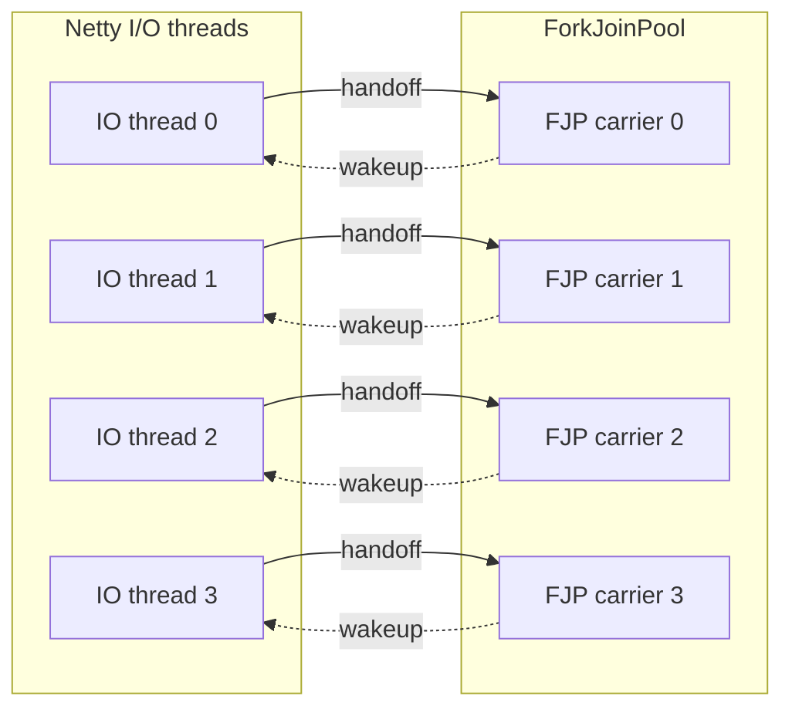
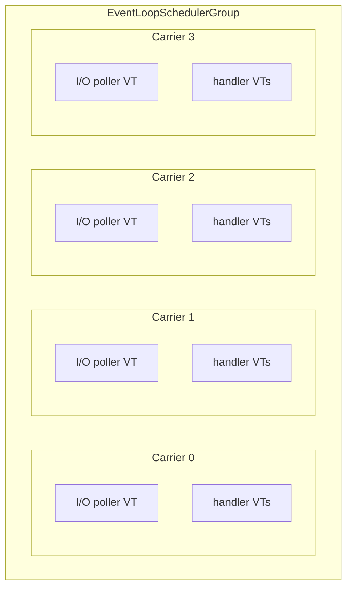

# Netty VirtualThread Scheduler

A locality-first virtual thread scheduler for the JVM. Virtual threads that work together run on the same carrier thread, reducing context switches and improving cache locality.

## Why

**You want locality.** The default ForkJoinPool scatters virtual threads across carriers randomly. When a Netty handler spawns a VT for blocking work, it runs on a different thread; when it posts back, that's a wakeup and a cache miss. This scheduler keeps related work on the same carrier — fewer context switches, better cache hit rates, less CPU wasted on handoffs. See [Netty with NIO](#netty-with-nio) or [without Netty](#locality-first-scheduling-without-netty).

**You need native transports.** Kernel I/O calls (epoll_wait, io_uring_enter) pin the virtual thread to its carrier. On ForkJoinPool, each native poller permanently occupies a shared carrier thread. This scheduler gives each native poller its own dedicated carrier, so pinning doesn't starve the rest of the system. See [Netty with native transport](#netty-with-native-transport-epoll--io_uring).

**You want control.** The scheduler exposes a simple API to register your own I/O pollers, get per-carrier thread factories, and decide exactly which virtual threads share a carrier. No black-box scheduling decisions — you control the topology. See [writing a custom pinned poller](#writing-a-custom-pinned-poller).

**This scheduler doesn't replace ForkJoinPool** — it runs alongside it. `Thread.ofVirtual()` still creates virtual threads on the default FJP, and third-party libraries that create their own virtual threads are unaffected. You choose which work runs on which scheduler:

```java
var group = new VirtualIoPollerEventLoopGroup(EpollIoHandler.newFactory());
var schedulerFactory = group.vThreadFactory();

schedulerFactory.newThread(() -> {
    // scope with our factory → forked tasks stay on the same carrier
    try (var scope = StructuredTaskScope.open(allSuccessfulOrThrow(),
            cf -> cf.withThreadFactory(schedulerFactory))) {
        scope.fork(() -> fetchFromCache());
        scope.join();
    }

    // scope without factory → forked tasks run on default FJP
    try (var scope = StructuredTaskScope.open(allSuccessfulOrThrow())) {
        scope.fork(() -> callThirdPartyLibrary());
        scope.join();
    }
}).start();
```

**Split topology (default)** — 8 OS threads for 4 cores, every arrow is a handoff:



**Unified topology (this scheduler)** — 4 OS threads, no cross-pool handoffs:



This scheduler runs I/O and virtual threads on the same carrier threads. No oversubscription, no cross-pool handoffs, and native pollers get their own dedicated carrier.

For the full analysis with benchmarks, see the [talk at Devoxx](https://youtu.be/Oy005l5vHtE?si=5epV66hc6PTPdDSB) and [slides](https://speakerdeck.com/franz1981/reactive-loom-a-forbidden-love-story).

## What it provides

1. **A carrier-affinity scheduler** (`EventLoopSchedulerGroup`) — a global pool of permanent carrier threads, each with its own MPSC queue. Virtual threads created from a carrier's factory have affinity to that carrier.
2. **Netty integration** — drop-in event loop groups that run Netty I/O on the scheduler's carriers, so handler-spawned virtual threads stay on the same carrier as the event loop that received the request.

## Quick guide

| Transport | Class | Pinned poller? |
|---|---|---|
| NIO / LOCAL | `VirtualIoEventLoopGroup` | No — NIO parks via Loom, carrier is freed |
| EPOLL / IO_URING | `VirtualIoPollerEventLoopGroup` | Yes — one per carrier, does kernel I/O |
| No Netty | `EventLoopSchedulerGroup` | Optional — `registerPinnedPoller()` |

## Architecture

```
EventLoopSchedulerGroup (global singleton, N carriers)
 ├── EventLoopScheduler[0]
 │    ├── carrier thread (permanent, daemon)
 │    ├── MPSC run queue
 │    └── virtualThreadFactory() → VTs with affinity to this carrier
 ├── EventLoopScheduler[1]
 │    └── ...
 └── EventLoopScheduler[N-1]
```

**Carrier threads** run forever (like ForkJoinPool workers). They drain the run queue and execute virtual thread continuations. When idle, they park.

**Virtual threads** created via a scheduler's `virtualThreadFactory()` are scheduled on that carrier. When they block, they park (freeing the carrier); when they resume, the continuation goes back into the same carrier's run queue.

A carrier can optionally host a **pinned poller** — a long-running virtual thread dedicated to kernel I/O (epoll_wait, io_uring_enter). It runs as a VT (not directly on the carrier thread) to avoid deadlocking the carrier: all carrier-to-VT coordination goes through lock-free structures. The scheduler coordinates preemption: when external VTs have work queued, the poller yields; when nothing is pending, the poller can block in kernel I/O.

## Prerequisites

- A Loom-enabled JDK (Java 27+, [builds.shipilev.net](https://builds.shipilev.net/openjdk-jdk-loom/) or build from [openjdk/loom](https://github.com/openjdk/loom))
- JVM flag: `-Djdk.virtualThreadScheduler.implClass=io.netty.loom.spi.NettyScheduler`
- Maven 3.6+

## Usage

### Netty with NIO

Use `VirtualIoEventLoopGroup`. NIO parks via Loom (carrier is freed), so no pinned poller is needed — the event loop just gets VT affinity to a carrier for locality.

```java
var group = new VirtualIoEventLoopGroup(4, NioIoHandler.newFactory());

new ServerBootstrap()
    .group(group)
    .channel(NioServerSocketChannel.class)
    .childHandler(/* ... */)
    .bind(8080).sync();
```

### Netty with native transport (EPOLL / IO_URING)

Use `VirtualIoPollerEventLoopGroup`. It registers a pinned poller on each carrier — a virtual thread that runs the Netty event loop and does kernel I/O (epoll_wait, io_uring_enter) with affinity to that carrier.

```java
var group = new VirtualIoPollerEventLoopGroup(EpollIoHandler.newFactory());

new ServerBootstrap()
    .group(group)
    .channel(EpollServerSocketChannel.class)
    .childHandler(new ChannelInitializer<SocketChannel>() {
        @Override
        protected void initChannel(SocketChannel ch) {
            ch.pipeline().addLast(new MyHandler(group));
        }
    })
    .bind(8080).sync();
```

Spawn virtual threads from a handler — they run on the same carrier as the event loop:

```java
class MyHandler extends SimpleChannelInboundHandler<FullHttpRequest> {
    private final VirtualIoPollerEventLoopGroup group;

    @Override
    protected void channelRead0(ChannelHandlerContext ctx, FullHttpRequest req) {
        group.vThreadFactory().newThread(() -> {
            // blocking work here — same carrier as the event loop
            byte[] result = blockingHttpCall();
            ctx.channel().eventLoop().execute(() -> writeResponse(ctx, result));
        }).start();
    }
}
```

### Locality-first scheduling without Netty

Use the scheduler directly. No Netty dependency needed — just the core module.

```java
var group = EventLoopSchedulerGroup.instance();
var scheduler = group.scheduler(0);

// all VTs from this factory have affinity to carrier 0
ThreadFactory tf = scheduler.virtualThreadFactory();
tf.newThread(() -> {
    // runs on carrier 0
    doWork();
}).start();
```

Round-robin across all carriers:

```java
var group = EventLoopSchedulerGroup.instance();
for (int i = 0; i < tasks; i++) {
    var scheduler = group.scheduler(i % group.size());
    scheduler.virtualThreadFactory().newThread(() -> doWork()).start();
}
```

### Writing a custom pinned poller

Register your own I/O poller on a carrier via `registerPinnedPoller`. The poller runs as a virtual thread with affinity to the carrier (not directly on the carrier thread — this avoids deadlocks by keeping all coordination lock-free). The returned `CompletionStage` completes when the poller exits and the slot is freed.

```java
var scheduler = EventLoopSchedulerGroup.instance().scheduler(0);

CompletionStage<Void> termination = scheduler.registerPinnedPoller(
    () -> { /* empty — no blocking, no wakeup needed */ },
    () -> {
        while (!shutdown) {
            int events = doPollNonBlocking();
            scheduler.maybeYield();
            processTasks();
            scheduler.maybeYield();
        }
    }
);
```

That's the simplest correct poller — non-blocking poll, yield between phases, no wakeup coordination needed. The scheduler handles the rest.

A pinned poller has three responsibilities:

1. **Yield CPU time to the scheduler.** Call `maybeYield()` between phases — it yields the carrier if external VTs have work queued, letting the carrier loop drain them before the poller resumes.

2. **Terminate.** The poller slot is freed when the body `Runnable` returns (via try-finally internally). The returned `CompletionStage` completes after cleanup, so callers can wait for the slot to be available again.

3. **Never miss a wakeup — if you choose to block.** The simple poller above never blocks, so it doesn't need wakeup coordination. But if you want to block in kernel I/O when idle (to save CPU), the blocking path introduces a coordination problem.

   The blocking decision must be made **inside your transport** — the transport must advertise it's about to sleep (store a flag) before checking `canBlock()` (a load), with a StoreLoad barrier between the two so the load cannot slip before the advertisement. This is the [Seastar sleep/wakeup pattern](https://www.scylladb.com/2018/02/15/memory-barriers-seastar-linux/): the symmetric store-barrier-load on both producer and consumer sides ensures at least one side always sees the other's store.

   This is how our Netty integration works: `canBlock()` is [injected into the ManualIoEventLoop](core/src/main/java/io/netty/loom/VirtualIoPollerEventLoopGroup.java) via override, the transport advertises sleep via a volatile write (`pollerRunning.set(false)`) before reading `canBlock()`, and the wakeup is the transport's own `eventLoop::wakeup` (see [netty#15922](https://github.com/netty/netty/issues/15922)):

   ```java
   // inject canBlock into the transport
   var eventLoop = new ManualIoEventLoop(parent, null, handlerFactory) {
       @Override
       public boolean canBlock() {
           return scheduler.canBlock();
       }
   };

   scheduler.registerPinnedPoller(
       eventLoop::wakeup,   // transport's own wakeup mechanism
       () -> {
           while (!eventLoop.isShuttingDown()) {
               eventLoop.run();      // transport checks canBlock() internally
               scheduler.maybeYield();
           }
       }
   );
   ```

   Between `canBlock()` returning true and the transport entering its blocking syscall, work may arrive and the scheduler calls `wakeup()`. That signal must not be lost. Two approaches:

   **Permit-based (lock-free):** The transport's wakeup is sticky — if called before the blocking call starts, the blocking call returns immediately. Examples: `eventfd` (stays readable until consumed), `Selector.wakeup()` (sets a flag), `LockSupport.unpark()` (stores a permit). This is what Netty's transports use.

   **Lock-based (rendezvous):** The `canBlock()` check and the blocking wait happen inside a lock shared with `wakeup()`. The signal cannot slip between the check and the wait. Note: `Condition.signal()` is **not** sticky — if it arrives before `Condition.await()`, it's lost. The queue-empty check must be inside the locked region.

   For background on why this coordination is subtle, see:
   - [Seastar's memory barrier approach](https://www.scylladb.com/2018/02/15/memory-barriers-seastar-linux/) — the symmetric store-barrier-load pattern between producer and consumer
   - [Mechanical-sympathy discussion](https://groups.google.com/g/mechanical-sympathy/c/yKQNVFAjui0/m/NAhfyjT-BAAJ) — why `Condition.signal()` deadlocks when it arrives before `Condition.await()`, and why permit-based mechanisms (`LockSupport.park`/`unpark`) don't have this problem
   - [Viktor Klang's actor](https://gist.github.com/viktorklang/2557678) — the atomic-flag-with-recheck pattern

Additional constraints:
- `canBlock()` is a snapshot — it can go stale immediately. Never cache the result.
- One poller per carrier. `registerPinnedPoller` throws if a poller is already registered.

For a deeper look at the store-barrier-load protocol, JCStress proofs that the guard prevents missed wakeups (and that removing it causes 94% signal loss), and the [`BlockingPollGuard`](concurrency-tests/src/main/java/io/netty/loom/concurrent/BlockingPollGuard.java) utility that encapsulates it, see [`concurrency-tests/README.md`](concurrency-tests/README.md).

## Configuration

| Property | Default | Description |
|---|---|---|
| `io.netty.loom.schedulers` | `availableProcessors()` | Number of carrier threads |
| `io.netty.loom.yield.us` | `10` | Yield duration in microseconds |
| `io.netty.loom.resumed.continuations` | `1024` | Initial MPSC queue capacity |

## Module structure

| Module | Description |
|---|---|
| `netty-virtualthread-bootstrap` | JDK-only shim (`NettyScheduler` + `NettySchedulerSpi`). Must be on the system classloader. |
| `netty-virtualthread-core` | Scheduler + Netty integration. Discovered via ServiceLoader (TCCL). |

## Fat JAR / application server deployment

The JVM loads the scheduler via the system classloader. Frameworks like Spring Boot use isolated classloaders. The bootstrap module must be visible to the system classloader; the core module is discovered via ServiceLoader through the TCCL.

### Spring Boot

Use Multi-Release JAR entries to expose bootstrap classes to the system classloader:

```xml
<!-- Mark as Multi-Release -->
<plugin>
    <groupId>org.apache.maven.plugins</groupId>
    <artifactId>maven-jar-plugin</artifactId>
    <configuration>
        <archive>
            <manifestEntries>
                <Multi-Release>true</Multi-Release>
            </manifestEntries>
        </archive>
    </configuration>
</plugin>

<!-- Unpack bootstrap into META-INF/versions/27/ -->
<plugin>
    <groupId>org.apache.maven.plugins</groupId>
    <artifactId>maven-dependency-plugin</artifactId>
    <executions>
        <execution>
            <id>unpack-bootstrap-scheduler</id>
            <phase>prepare-package</phase>
            <goals><goal>unpack</goal></goals>
            <configuration>
                <artifactItems>
                    <artifactItem>
                        <groupId>io.netty.loom</groupId>
                        <artifactId>netty-virtualthread-bootstrap</artifactId>
                        <version>${netty-loom.version}</version>
                        <type>jar</type>
                        <includes>io/netty/loom/spi/**</includes>
                        <outputDirectory>${project.build.outputDirectory}/META-INF/versions/27</outputDirectory>
                    </artifactItem>
                </artifactItems>
            </configuration>
        </execution>
    </executions>
</plugin>

<!-- Exclude bootstrap from BOOT-INF/lib/ -->
<plugin>
    <groupId>org.springframework.boot</groupId>
    <artifactId>spring-boot-maven-plugin</artifactId>
    <configuration>
        <excludes>
            <exclude>
                <groupId>io.netty.loom</groupId>
                <artifactId>netty-virtualthread-bootstrap</artifactId>
            </exclude>
        </excludes>
    </configuration>
</plugin>
```

### Application servers (OpenLiberty, WildFly)

Place the bootstrap JAR on the system classpath or `-Xbootclasspath/a:`. The core JAR stays inside the application deployment (WAR/EAR).

## Dev container

The easiest way to get started is the provided dev container (`.devcontainer/`), which uses `shipilev/openjdk:loom`.

Works with VS Code (Dev Containers extension) and IntelliJ IDEA (File > Remote Development > Dev Containers).

## Build

```sh
export JAVA_HOME=/path/to/loom-jdk
mvn clean install
```

## License

Apache License 2.0 — see [LICENSE](LICENSE).

Credit: [dreamlike-ocean](https://github.com/dreamlike-ocean) for identifying and fixing the fat-JAR classloader issue.
