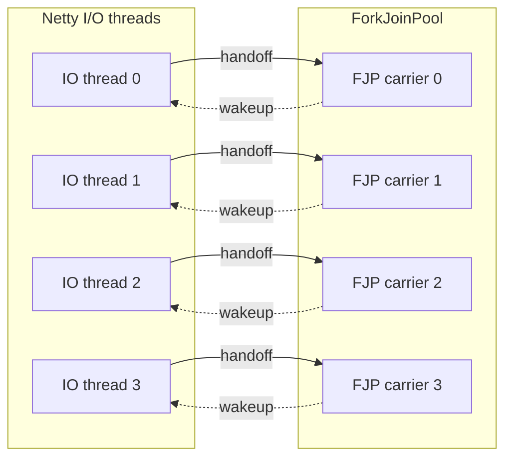
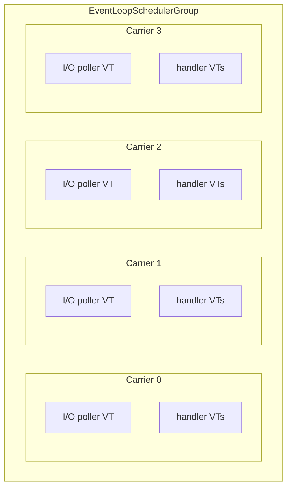

# Netty VirtualThread Scheduler

A locality-first virtual thread scheduler for the JVM. Virtual threads that work together run on the same carrier thread, reducing context switches and improving cache locality.

## Why

**You want locality.** The default ForkJoinPool scatters virtual threads across carriers randomly. When a Netty handler spawns a VT for blocking work, it runs on a different thread; when it posts back, that's a wakeup and a cache miss. This scheduler keeps related work on the same carrier — fewer context switches, better cache hit rates, less CPU wasted on handoffs. See [Netty with NIO](#netty-with-nio) or [without Netty](#locality-first-scheduling-without-netty).

**You need native transports.** Kernel I/O calls (epoll_wait, io_uring_enter) pin the virtual thread to its carrier. On ForkJoinPool, each native poller permanently occupies a shared carrier thread. This scheduler gives each native poller its own dedicated carrier, so pinning doesn't starve the rest of the system. See [Netty with native transport](#netty-with-native-transport-epoll--io_uring).

**You want control.** The scheduler exposes a simple API to register your own I/O pollers, get per-carrier thread factories, and decide exactly which virtual threads share a carrier. No black-box scheduling decisions — you control the topology. See [writing a custom pinned poller](#writing-a-custom-pinned-poller).

**This scheduler doesn't replace ForkJoinPool** — it runs alongside it. `Thread.ofVirtual()` still creates virtual threads on the default FJP, and third-party libraries that create their own virtual threads are unaffected. You choose which work runs on which scheduler:

```java
var group = new VirtualIoNativePollerEventLoopGroup(EpollIoHandler.newFactory());
var schedulerFactory = group.vThreadFactory();

schedulerFactory.newThread(() -> {
    // scope with our factory → forked tasks stay on the same carrier
    try (var scope = StructuredTaskScope.open(allSuccessfulOrThrow(),
            cf -> cf.withThreadFactory(schedulerFactory))) {
        scope.fork(() -> fetchFromCache());
        scope.join();
    }

    // scope without factory → forked tasks run on default FJP
    try (var scope = StructuredTaskScope.open(allSuccessfulOrThrow())) {
        scope.fork(() -> callThirdPartyLibrary());
        scope.join();
    }
}).start();
```

**Split topology (default)** — 8 OS threads for 4 cores, every arrow is a handoff:



**Unified topology (this scheduler)** — 4 OS threads, no cross-pool handoffs:



This scheduler runs I/O and virtual threads on the same carrier threads. No oversubscription, no cross-pool handoffs, and native pollers get their own dedicated carrier.

For the full analysis with benchmarks, see the [talk at Devoxx](https://youtu.be/Oy005l5vHtE?si=5epV66hc6PTPdDSB) and [slides](https://speakerdeck.com/franz1981/reactive-loom-a-forbidden-love-story).

## What it provides

1. **A carrier-affinity scheduler** (`EventLoopSchedulerGroup`) — a global pool of permanent carrier threads, each with its own MPSC queue. Virtual threads created from a carrier's factory have affinity to that carrier.
2. **Netty integration** — drop-in event loop groups that run Netty I/O on the scheduler's carriers, so handler-spawned virtual threads stay on the same carrier as the event loop that received the request.

## Quick guide

| Transport | Class | Pinned poller? |
|---|---|---|
| NIO | `VirtualIoNioPollerEventLoopGroup` | Yes — priority poller, anti-steal; NIO parks via Loom (carrier freed) |
| EPOLL / IO_URING | `VirtualIoNativePollerEventLoopGroup` | Yes — one per carrier, kernel I/O pins carrier |
| NIO (lightweight) | `VirtualIoEventLoopGroup` | No — event loop as regular VT, no anti-steal |
| No Netty | `EventLoopSchedulerGroup` | Optional — `registerPinnedPoller()` |

## Architecture

```
EventLoopSchedulerGroup (global singleton, N carriers)
 ├── EventLoopScheduler[0]
 │    ├── carrier thread (permanent, daemon)
 │    ├── MPSC run queue
 │    └── virtualThreadFactory() → VTs with affinity to this carrier
 ├── EventLoopScheduler[1]
 │    └── ...
 └── EventLoopScheduler[N-1]
```

**Carrier threads** run forever (like ForkJoinPool workers). They drain the run queue and execute virtual thread continuations. When idle, they park.

**Virtual threads** created via a scheduler's `virtualThreadFactory()` are scheduled on that carrier. When they block, they park (freeing the carrier); when they resume, the continuation goes back into the same carrier's run queue.

A carrier can optionally host a **pinned poller** — a long-running virtual thread dedicated to kernel I/O (epoll_wait, io_uring_enter). It runs as a VT (not directly on the carrier thread) to avoid deadlocking the carrier: all carrier-to-VT coordination goes through lock-free structures. The scheduler coordinates preemption: when external VTs have work queued, the poller yields; when nothing is pending, the poller can block in kernel I/O.

## Prerequisites

- A Loom-enabled JDK (Java 27+, [builds.shipilev.net](https://builds.shipilev.net/openjdk-jdk-loom/) or build from [openjdk/loom](https://github.com/openjdk/loom))
- JVM flag: `-Djdk.virtualThreadScheduler.implClass=io.netty.loom.scheduler.NettyScheduler`
- Maven 3.6+

## Usage

### Netty with NIO

Use `VirtualIoNioPollerEventLoopGroup`. NIO parks via Loom (carrier is freed), so the event loop doesn't pin the carrier. The poller registration gives the event loop priority scheduling and prevents it from being stolen when work stealing is enabled.

```java
var group = new VirtualIoNioPollerEventLoopGroup(NioIoHandler.newFactory());

new ServerBootstrap()
    .group(group)
    .channel(NioServerSocketChannel.class)
    .childHandler(/* ... */)
    .bind(8080).sync();
```

For a lightweight alternative without anti-steal guarantees, use `VirtualIoEventLoopGroup`:

```java
var group = new VirtualIoEventLoopGroup(4, NioIoHandler.newFactory());
```

### Netty with native transport (EPOLL / IO_URING)

Use `VirtualIoNativePollerEventLoopGroup`. It registers a pinned poller on each carrier — a virtual thread that runs the Netty event loop and does kernel I/O (epoll_wait, io_uring_enter) with affinity to that carrier.

```java
var group = new VirtualIoNativePollerEventLoopGroup(EpollIoHandler.newFactory());

new ServerBootstrap()
    .group(group)
    .channel(EpollServerSocketChannel.class)
    .childHandler(new ChannelInitializer<SocketChannel>() {
        @Override
        protected void initChannel(SocketChannel ch) {
            ch.pipeline().addLast(new MyHandler(group));
        }
    })
    .bind(8080).sync();
```

Spawn virtual threads from a handler — they run on the same carrier as the event loop:

```java
class MyHandler extends SimpleChannelInboundHandler<FullHttpRequest> {
    private final VirtualIoNativePollerEventLoopGroup group;

    @Override
    protected void channelRead0(ChannelHandlerContext ctx, FullHttpRequest req) {
        group.vThreadFactory().newThread(() -> {
            // blocking work here — same carrier as the event loop
            byte[] result = blockingHttpCall();
            ctx.channel().eventLoop().execute(() -> writeResponse(ctx, result));
        }).start();
    }
}
```

### Locality-first scheduling without Netty

Use the scheduler directly. No Netty dependency needed — just the bootstrap module.

```java
var group = EventLoopSchedulerGroup.instance();
var scheduler = group.scheduler(0);

// all VTs from this factory have affinity to carrier 0
ThreadFactory tf = scheduler.virtualThreadFactory();
tf.newThread(() -> {
    // runs on carrier 0
    doWork();
}).start();
```

Round-robin across all carriers:

```java
var group = EventLoopSchedulerGroup.instance();
for (int i = 0; i < tasks; i++) {
    var scheduler = group.scheduler(i % group.size());
    scheduler.virtualThreadFactory().newThread(() -> doWork()).start();
}
```

### Writing a custom pinned poller

Register your own I/O poller on a carrier via `registerPinnedPoller`. The poller runs as a virtual thread with affinity to the carrier (not directly on the carrier thread — this avoids deadlocks by keeping all coordination lock-free). The returned `CompletionStage` completes when the poller exits and the slot is freed.

```java
var scheduler = EventLoopSchedulerGroup.instance().scheduler(0);

CompletionStage<Void> termination = scheduler.registerPinnedPoller(
    () -> {},  // spinning — never sleeps, wakeup is a no-op
    () -> {
        while (!shutdown) {
            int events = doPollNonBlocking();
            scheduler.maybeYield(events > 0);  // report I/O activity
            processTasks();
            scheduler.maybeYield(events > 0);
        }
    }
);
```

That's the simplest correct poller — non-blocking poll, yield between phases, no wakeup coordination needed. The scheduler handles the rest.

A pinned poller has three responsibilities:

1. **Yield CPU time and report I/O activity.** Call `maybeYield(hadIoWork)` between phases. The boolean argument tells the scheduler whether the poller processed I/O events since the last call:

   - **`hadIoWork=true`**: the poller has I/O to process. The scheduler only yields for local VT preemption — no work stealing, because the carrier is doing useful work.
   - **`hadIoWork=false`**: the poller is idle. The scheduler may attempt to steal work from an overloaded sibling (if [work stealing](#work-stealing-experimental) is enabled), helping reduce tail latency when load is uneven.

   What `hadIoWork` controls is the **steal path**: when `false`, the scheduler may steal from an overloaded sibling; when `true`, stealing is suppressed because the carrier is doing useful I/O work. Passing `true` incorrectly would prevent the carrier from ever stealing, while passing `false` incorrectly would make the carrier steal when it should be doing I/O. **Get this right** — it's the feedback loop between the poller and the scheduler.

   A spinning poller (one that never blocks) will never enter PARKED state, so the nSearching directed-steal protocol cannot target it. But it participates in the pull path — `tryStealing` in `maybeYield` probes siblings when `hadIoWork=false`. It can also be stolen FROM via the directed path (another carrier wakes an idle sibling to steal from this carrier's queue via `signalWorkFor`).

2. **Terminate.** The poller slot is freed when the body `Runnable` returns (via try-finally internally). The returned `CompletionStage` completes after cleanup, so callers can wait for the slot to be available again.

3. **Handle wakeup signals.** The wakeup `Runnable` is called from any thread when the scheduler needs to interrupt the poller's blocking I/O (e.g., eventfd write for epoll/io_uring). It must be thread-safe and idempotent. The scheduler only calls it after CAS'ing the carrier state — never spuriously.

   - **Non-blocking poller (spin-poll):** use a no-op wakeup (`() -> {}`) — the poller never sleeps, so there is nothing to interrupt.
   - **Blocking poller (native transport):** track whether you're inside the blocking syscall (e.g. a volatile flag set before `epoll_wait()` and cleared after). When the wakeup fires, send the interrupt signal (e.g. eventfd write) if the flag is set. The wakeup is a `Runnable` — it doesn't return a value.
   - **Loom-friendly poller (NIO):** use a no-op wakeup — NIO's `select()` parks via Loom, freeing the carrier. The carrier parks in its scheduler loop and is woken via `LockSupport.unpark()`, not via the poller wakeup. See `VirtualIoNioPollerEventLoopGroup`.

4. **Never miss a wakeup — if you choose to block.** The simple poller above never blocks, so it doesn't need wakeup coordination. But if you want to block in kernel I/O when idle (to save CPU), the blocking path introduces a coordination problem.

   The blocking decision must be made **inside your transport** — the transport must advertise it's about to sleep (store a flag) before checking `canParkPoller()` (a load), with a StoreLoad barrier between the two so the load cannot slip before the advertisement. This is the [Seastar sleep/wakeup pattern](https://www.scylladb.com/2018/02/15/memory-barriers-seastar-linux/): the symmetric store-barrier-load on both producer and consumer sides ensures at least one side always sees the other's store.

   This is how the native transport integration works: `canParkPoller()` is [injected into the ManualIoEventLoop](core/src/main/java/io/netty/loom/VirtualIoNativePollerEventLoopGroup.java) via override, the transport advertises sleep via a volatile write (`pollerRunning.set(false)`) before reading `canParkPoller()`, and the wakeup sends an eventfd write to interrupt the blocked poller (see [netty#15922](https://github.com/netty/netty/issues/15922)):

   ```java
   var pollerRunning = new AtomicBoolean(false);

   var eventLoop = new ManualIoEventLoop(parent, null, handlerFactory) {
       @Override
       public boolean canBlock() {
           return scheduler.canParkPoller();
       }
   };

   scheduler.registerPinnedPoller(
       () -> eventLoop.wakeup(),    // wakeup: interrupt blocking I/O
       () -> {
           pollerRunning.set(true);
           boolean canBlock = false;
           while (!eventLoop.isShuttingDown()) {
               int events;
               if (canBlock && scheduler.tryParkPoller()) {
                   pollerRunning.set(false);
                   try {
                       events = eventLoop.run(MAX_WAIT_NS, YIELD_NS);
                   } finally {
                       pollerRunning.set(true);
                       scheduler.unpark();
                   }
               } else {
                   events = eventLoop.runNow(YIELD_NS);
               }
               boolean hadVtWork = scheduler.maybeYield(events > 0);
               canBlock = events == 0 && !hadVtWork;
           }
       }
   );
   ```

   A blocking poller must follow three steps:

   1. **`tryParkPoller()`** — transitions the carrier to PARKED. If it returns `false`, do a non-blocking poll instead.
   2. **`canParkPoller()`** (via `canBlock()`) — called by the transport right before the actual blocking syscall. Verifies the carrier is still PARKED and no work arrived. Between `tryParkPoller()` and the blocking call, the poller VT may be transiently descheduled (e.g. contended lock), during which the carrier loop can reset PARKED to RUNNING. If `canParkPoller()` returns `false`, the transport must skip the blocking syscall and do a non-blocking poll — the poller loop will call `unpark()` and retry on the next iteration.
   3. **`unpark()`** — called immediately after waking from blocking I/O. Resets the carrier state and handles any pending directed-steal signals.

   Beyond the state check, the wakeup signal itself must not be lost. Two approaches:

   **Permit-based (lock-free):** The transport's wakeup is sticky — if called before the blocking call starts, the blocking call returns immediately. Examples: `eventfd` (stays readable until consumed), `Selector.wakeup()` (sets a flag), `LockSupport.unpark()` (stores a permit). This is what Netty's transports use.

   **Lock-based (rendezvous):** The `canParkPoller()` check and the blocking wait happen inside a lock shared with `wakeup()`. The signal cannot slip between the check and the wait. Note: `Condition.signal()` is **not** sticky — if it arrives before `Condition.await()`, it's lost. The queue-empty check must be inside the locked region.

   For background on why this coordination is subtle, see:
   - [Seastar's memory barrier approach](https://www.scylladb.com/2018/02/15/memory-barriers-seastar-linux/) — the symmetric store-barrier-load pattern between producer and consumer
   - [Mechanical-sympathy discussion](https://groups.google.com/g/mechanical-sympathy/c/yKQNVFAjui0/m/NAhfyjT-BAAJ) — why `Condition.signal()` deadlocks when it arrives before `Condition.await()`, and why permit-based mechanisms (`LockSupport.park`/`unpark`) don't have this problem
   - [Viktor Klang's actor](https://gist.github.com/viktorklang/2557678) — the atomic-flag-with-recheck pattern

Additional constraints:
- `canParkPoller()` verifies the carrier is still PARKED and no work is pending. It is a snapshot — never cache the result.
- One poller per carrier. `registerPinnedPoller` throws if a poller is already registered.

For a deeper look at the store-barrier-load protocol, JCStress proofs that the guard prevents missed wakeups (and that removing it causes 94% signal loss), and the [`BlockingPollGuard`](concurrency-tests/src/main/java/io/netty/loom/concurrent/BlockingPollGuard.java) utility that encapsulates it, see [`concurrency-tests/README.md`](concurrency-tests/README.md).

## Performance tuning

See [`PERFORMANCE.md`](PERFORMANCE.md) for latency/throughput analysis, idle spin
trade-offs, work stealing tuning, and FJP comparison with benchmark commands.

## Configuration

| Property | Default | Description |
|---|---|---|
| `io.netty.loom.schedulers` | `availableProcessors()` | Number of carrier threads |
| `io.netty.loom.yield.us` | `50` | Yield duration in microseconds |
| `io.netty.loom.idleSpins` | `0` | Idle spin iterations before blocking. When >0, the poller spins this many iterations (calling `Thread.onSpinWait()`) before entering the blocking I/O path. Prevents batch formation at the cost of higher CPU usage below saturation. **The effective spin duration depends on the transport:** each iteration includes a non-blocking I/O poll — measured at ~0.42µs for epoll (syscall) and ~0.05µs for io_uring (shared-memory CQ peek) under continuous spinning. So 256 spins ≈ 108µs with epoll but only ~13µs with io_uring. The same spin count is not interchangeable across transports. |
| `io.netty.loom.resumed.continuations` | `1024` | Initial MPSC queue capacity |
| `io.netty.loom.workstealing.enabled` | `false` | Enable work stealing (experimental) |

## Work stealing (experimental)

Work stealing allows idle carriers to help overloaded siblings by taking virtual
threads from their run queues. It is **opt-in** and designed around a
**locality-first** principle.

Enable with `-Dio.netty.loom.workstealing.enabled=true`.

### Locality-first principle

Each virtual thread has a **home carrier** — the carrier whose factory created it.
The VT's I/O (sockets, channels) is registered on the home carrier's event loop.
Running the VT on its home carrier means I/O completions arrive on the same carrier
with no cross-carrier wakeups, no cache misses, and no eventfd writes.

**Stealing violates locality.** A stolen VT runs on a foreign carrier. When it
completes and calls `channel.writeAndFlush()`, the write goes to the home carrier's
event loop task queue — a cross-carrier hop. When the VT yields or blocks, its
continuation routes back to the home carrier's MPSC queue (non-sticky stealing).

This is why stealing is **reluctant** — only steal when idle, only from siblings
with queued work. The design is **topology-aware**: when `LinuxCarrierTopology` is
enabled, carriers are grouped by LLC cluster and siblings are ordered by proximity.

### Sources of inspiration

The protocol is a hybrid of ideas from three systems, adapted for our unique
constraint: **carriers have a primary job (I/O + own queue), and work stealing
is opt-in**.

**Go runtime (`src/runtime/proc.go`):**
- The `nmspinning` counter and `wakep()` protocol inspired our per-cluster
  `nSearching` counter with CAS 0→1 admission control.
- Go's dual-sided `#StoreLoad` barrier protocol (submitters check `nmspinning`,
  spinners re-check all queues after decrementing) ensures signals are never
  lost. Our `tryStartSearcher` + `signalWorkFor` follows the same principle.
- Go allows up to `GOMAXPROCS/2` concurrent spinners; we cap at 1 per cluster.
  Go's workers have no primary job — spinning is their idle state. Our carriers
  should be doing I/O, not scanning.
- Known issues in Go's protocol: [#43997](https://github.com/golang/go/issues/43997)
  (non-spinning Ms spin uselessly — 12% wall-time reduction when fixed),
  [#13527](https://github.com/golang/go/issues/13527) (Gosched causes futex
  thrashing — 5% CPU wasted on futex calls).
- See: [Scalable Go Scheduler Design](https://go.dev/s/go11sched) by Dmitry Vyukov.

**ForkJoinPool (`java.util.concurrent.ForkJoinPool`):**
- FJP uses a Treiber stack (LIFO) for idle workers — O(1) CAS pop to wake
  the most-recently-parked worker (cache-warm). We use an `IdleCarrierTracker`
  bitmap instead, which supports topology-aware waking (`wakeFirstIdle` can
  prefer nearby carriers).
- FJP has **no nSearching counter** — all idle workers scan simultaneously
  with randomized exhaustive strides. Contention is managed by natural backoff
  and deactivation, not admission control. This works because FJP workers
  exist only to steal; our carriers have I/O to do.
- FJP gates steal-signal propagation: `signalWork()` after a steal fires only
  when `prevSrc != src` (first steal from a new queue) AND the queue still has
  items. For VT tasks (`noUserHelp() != 0`), propagation is unconditional.
  Our `signalWorkFor` after a steal is currently unconditional.
- FJP annotates hot fields with `@Contended` for false-sharing protection:
  `ctl` (the idle stack + counters), and WorkQueue's `phase`, `source`,
  `parking`, `stackPred`, `top`, `nsteals`. Our `ClusterState.nSearching`
  has no padding — a known gap.
- References: Chase and Lev (SPAA 2005), Michael-Saraswat-Vechev (PPoPP 2009),
  Le-Pop-Cohen-Nardelli (PPoPP 2013).

**Danny Thomas's cluster-aware experiments:**
- [virtual-threads-cluster-aware](https://github.com/DanielThomas/virtual-threads-cluster-aware)
  on the [loom-dev mailing list](https://mail.openjdk.org/pipermail/loom-dev/2024-September/007161.html)
  (September 2024). His `CHOOSE_TWO` placement strategy — power-of-2 choices for
  selecting the least loaded cluster — delivered ~29% more throughput than the default
  FJP scheduler on an AMD EPYC 9R14 (CCX-clustered L3 caches).

### Why limit searchers at all

The naive approach — wake an idle thread every time a goroutine/VT is readied —
leads to **excessive thread parking/unparking**. Go's runtime
[documents this explicitly](https://github.com/golang/go/blob/go1.24.4/src/runtime/proc.go#L21-L109):

> *Three rejected approaches that would work badly: [...] (3) Unpark an additional
> thread whenever we ready a goroutine and there is an idle P, but don't do handoff.
> This would lead to excessive thread parking/unparking as the additional threads
> will instantly park without discovering any work to do.*

Go's solution: maintain at least one **spinning** thread (searching for work). If a
spinner already exists (`nmspinning > 0`), don't wake another — the existing spinner
will discover the work. When the last spinner finds work and stops spinning, it wakes
a replacement. This *"smooths out unjustified spikes of thread unparking, but at the
same time guarantees eventual maximal CPU parallelism utilization."*

Our `nSearching` counter serves the same purpose: prevent wakeup storms. If a search
is already in flight (CAS 0→1 succeeded), additional `signalWorkFor` calls are
suppressed. When the searcher completes, the chain propagates if the victim still has
work. One searcher at a time, sequential recruitment — no thundering herd.

The trade-off: with nSearching=1 per cluster, only one victim gets push-path help
at a time. If multiple carriers in the same cluster are overloaded, redistribution
is serialized. Whether this matters depends on how often multiple victims coexist —
we don't have data on this yet. A direct signal: how often `tryStartSearcher` fails
(CAS 0→1 returns false) while a different carrier needs help.

### Searcher limits: us vs Go vs FJP

All three systems must answer: how many threads should actively search for
stealable work? Too few delays redistribution; too many wastes CPU on
fruitless scanning.

| Aspect | This scheduler | Go runtime | ForkJoinPool |
|--------|---------------|------------|--------------|
| **Push path limit** | `nSearching` CAS(0→1) — 1 per cluster | `wakep()` CAS(0→1) — 1 at a time | `signalWork()` pops Treiber stack — 1 at a time |
| **Ongoing searchers** | Strictly 0 or 1 | Dynamic: `2*nmspinning < busy_procs` | No limit — all idle workers scan |
| **Chain propagation** | `signalWorkFor(victim)` after steal | "Last spinner wakes next" via `wakep()` | `signalWork()` after steal if `prevSrc != src` |
| **Scan strategy** | Power-of-2 random (O(1), 2 siblings) | Coprime enumeration of ALL Ps, 4 passes | Coprime stride over ALL queues |
| **Directed steal** | Yes — victim encoded in `SEARCHING+id` | No — spinners scan all queues | No — workers scan all queues |
| **Pull path (separate)** | `tryStealing` in `maybeYield` — no limit | None — all stealing via `findrunnable` | None — all stealing via `runWorker` scan |

**Key finding: Go's `wakep()` is also CAS(0→1).** It wakes exactly one spinner,
just like our `tryStartSearcher`. The difference is how spinners *persist*: Go's
`findrunnable()` allows an M to *become* spinning if `2*nmspinning < (gomaxprocs -
npidle)` — a soft, racy inequality check, not a CAS. Multiple Ms can pass this
check simultaneously, so `nmspinning` can briefly exceed the target. Our counter
is strictly 0 or 1 at all times. (Go source:
[`wakep` CAS(0,1)](https://github.com/golang/go/blob/go1.24.4/src/runtime/proc.go#L3117),
[`findrunnable` spinning check](https://github.com/golang/go/blob/go1.24.4/src/runtime/proc.go#L3384).)

**FJP has no limit at all.** All idle workers scan simultaneously with randomized
coprime strides that visit every queue. Workers back off naturally via `deactivate()`
spin + `awaitWork()` park. No counter tracks how many are scanning. (FJP source at
Loom `dc6f316e036`: [`signalWork` L1871](https://github.com/openjdk/loom/blob/dc6f316e036/src/java.base/share/classes/java/util/concurrent/ForkJoinPool.java#L1871),
[`scan:` loop L1986](https://github.com/openjdk/loom/blob/dc6f316e036/src/java.base/share/classes/java/util/concurrent/ForkJoinPool.java#L1986),
[`deactivate` L2042](https://github.com/openjdk/loom/blob/dc6f316e036/src/java.base/share/classes/java/util/concurrent/ForkJoinPool.java#L2042).)

**Why our approach differs:** our carriers have a **dedicated I/O loop** — each
carrier owns a pinned poller VT bound to a specific epoll/io_uring fd. Stealing
competes with I/O polling for carrier time. Go's Ms also do I/O polling, but
via a **shared** netpoller (`netpoll()` in `findrunnable()`) — any M can poll
it and it returns ready goroutines from all fds. There is no per-M epoll fd.
FJP workers don't poll at all (Netty I/O runs on separate platform threads).
In both Go and FJP, scanning for steals is a natural part of the idle path,
not competing with a dedicated per-thread I/O responsibility.
We use two independent paths:

- **Push (nSearching=1):** directed steal from a known victim. The searcher knows
  exactly where to look — no scanning needed. Chain propagation recruits the next
  searcher sequentially. O(N) recruitment for N idle carriers, but O(1) per steal.
- **Pull (tryStealing, no limit):** every idle poller iteration probes siblings via
  power-of-2. This runs independently of nSearching — unlimited concurrent probes,
  same as FJP in spirit.

The total steal activity is: 1 directed + N pull probes per idle cycle (where N =
idle pollers with `!hadIoWork`). This is comparable to or more permissive than Go
(which subjects ALL stealing to the nmspinning check) — just structured differently.

**Trade-offs:**

| | Pro | Con |
|---|---|---|
| **nSearching=1** | Low contention on victim's ticket lock; directed steal = no wasted scans | Multiple overloaded carriers in same cluster: only one gets help at a time via push path |
| **Go nmspinning** | Dynamic limit scales with load; dual-sided barrier prevents missed signals | Known issues: [#43997](https://github.com/golang/go/issues/43997) (12% CPU wasted on useless spinning), [#13527](https://github.com/golang/go/issues/13527) (futex thrashing) |
| **FJP unlimited** | Fastest convergence — all idle workers scan simultaneously | Highest contention on victim queues; mitigated by `@Contended` padding and LIFO stack |

**Open question:** should `nSearching` be raised to allow multiple directed steals
simultaneously (e.g., two overloaded carriers each recruiting a helper)? The current
pull path compensates, but the push path's sequential chain is a bottleneck when
multiple victims exist. Benchmarking at 16+ carriers with uneven load would reveal
whether this matters in practice.

### The nSearching protocol

The protocol has two paths: **push** (directed, from submissions) and **pull**
(speculative, from idle pollers).

**Push path — nSearching + directed steal:**

When a carrier has work submitted via `execute()` and the carrier is already
running (not just woken):

```
execute(task):
    runQueue.offer(task)
    if (submitter != carrierThread):
        if (submitter.runningScheduler != this):
            wakeup()  // wake target from blocking I/O
        else if (WORK_STEALING_ENABLED):
            signalWork()  // recruit a sibling to help
```

`signalWork()` → `signalWorkFor(victim)`:
1. `tryStartSearcher()` — CAS 0→1 on per-cluster `nSearching`. Fails if a
   search is already in progress (at most 1 concurrent searcher per cluster).
2. `wakeFirstIdle(group, victim)` — scan idle bitmap for a PARKED carrier.
   If found: `wakeupAsSearcher(victim)` — CAS(PARKED → SEARCHING+victim.id)
   + `LockSupport.unpark` + poller eventfd write.
3. If no idle carrier: `stoppedSearching()` (release the nSearching token).

The woken carrier processes `SEARCHING+victim.id` via `handleSearchWake`:
1. Steal one task from the encoded victim.
2. `stoppedSearching()` — release the nSearching token.
3. If the victim still has work: `signalWorkFor(victim)` — recruit the next
   searcher (chain propagation).
4. Run the stolen task (inline from carrier loop, queued from poller VT).

**Pull path — speculative stealing from `maybeYield`:**

When the pinned poller has no I/O work:

```
maybeYield(hadIoWork=false):
    if (hasRunnableContinuations()):
        Thread.yield()  // drain local work first
    else:
        tryStealing(false)  // probe siblings
```

`tryStealing` uses **power-of-2 random probing**: pick 2 random siblings,
choose the one with more queued work (`worthStealing()` — non-empty queue).
After a successful steal, `signalWorkFor(victim)` fires if the victim still
has work — connecting the pull path to the push protocol.

**Carrier state machine:**

```
              tryPark()          wakeup()
  RUNNING(0) ───────→ PARKED(1) ───────→ RUNNING(0)
                  │                           ↑
                  │   wakeupAsSearcher()       │
                  └──→ SEARCHING(2+id) ────────┘
                           │        unparkImpl()
                           └── handleSearchWake()
                                → steal from victim
                                → stoppedSearching()
```

**Invariant:** every `tryStartSearcher()` success (CAS 0→1) is matched by
exactly one `stoppedSearching()` decrement — either from `signalWorkFor`
(no idle carrier found) or from `handleSearchWake` (steal processed).

The carrier loop eagerly checks for pending SEARCHING state at the top of
each iteration, ensuring directed steals are never delayed when the carrier
has local work to drain.

### Submission paths

Virtual thread continuations arrive in `execute()` from three sources:

**External submissions** (from a different carrier or a platform thread):
- The submitter's `runningScheduler()` differs from the target → `wakeup()` fires
  to interrupt the target's blocking I/O or unpark its carrier.
- If `wakeup()` failed (carrier was not sleeping) → `signalWork()` recruits an
  idle sibling via the nSearching protocol.

**Internal submissions** (a VT running on this carrier submits to the same carrier):
- The submitter's `runningScheduler()` matches → no self-wakeup needed.
- `signalWork()` still fires — covers the case where a VT monopolizes a carrier
  and spawns many children. An idle sibling is recruited to help.

**Yield / re-enqueue** (onContinue path, runs on the carrier thread itself):
- Skipped entirely — the carrier thread is actively draining, no wakeup or help
  needed. The carrier will pick up the re-enqueued continuation on its next
  drain cycle.

### Park/unpark protocol

The carrier uses a **Viktor Klang mini-actor pattern** adapted for park/unpark
with directed-steal signals:

- `tryPark()`: CAS(RUNNING→PARKED) + markIdle in bitmap + re-check for work.
  If work arrived between drain and CAS, rolls back atomically. The rollback
  handles concurrent `wakeupAsSearcher` CAS (TOCTOU via `getAndSet`).
- `unpark()` / `unparkFromCarrier()`: markActive + `getAndSet(RUNNING)`.
  If wakeState was SEARCHING, processes `handleSearchWake` — steals from the
  directed victim. `unparkFromCarrier()` runs the stolen task inline;
  `unpark()` queues it (for poller VT context where inline execution is
  not possible).

### Why power-of-2 choices

Victim selection uses **power-of-2 random probing**: pick 2 random siblings,
choose the better candidate. This gives near-optimal selection with O(1) cost.

From a scalability perspective (Neil Gunther's Universal Scalability Law), the
coherency penalty grows with the number of parties contending on shared state.
Scanning all N siblings means N volatile reads × M concurrent stealers = O(N×M)
coherency traffic. Power-of-2 reduces it to O(1) per attempt — two reads, no
shared counter. ForkJoinPool avoids scanning with a Treiber stack (O(1) CAS pop),
but requires a shared atomic. Power-of-2 has **zero shared contention**.

### Ticket lock: biased consumer coordination

The MPSC queue (`MpscUnboundedQueue`) is single-consumer by design.
Work stealing introduces a second consumer (the stealer). A **ticket lock**
coordinates access with asymmetric paths:

**Carrier (owner)** — `acquireConsumer()` / `releaseConsumer(ticket)`:
uses `XADD` (atomic increment) on `consumerTicket`, then spins on `consumerServing`
until its ticket is served. Wait-free in the common case (no stealer active).
When a stealer is mid-poll, the carrier spins briefly via `Thread.onSpinWait()`.

**Stealer** — `tryStealOne()`:
uses `CAS` on `consumerTicket`. If the carrier or another stealer holds the lock,
the CAS fails immediately and the stealer gives up (returns null). No spinning,
no blocking — best-effort only.

This is intentionally **biased toward the carrier**: the owner always succeeds
(XADD), the stealer gives up on contention (CAS failure). The carrier's drain
throughput is never degraded by steal attempts. An `isEmpty()` fast-path before
`acquireConsumer()` avoids the XADD entirely on empty polls.

### Queue order: FIFO everywhere

Both the carrier and the stealer consume from the same MPSC queue head (FIFO).
The oldest virtual thread continuation is processed first, regardless of whether
it's drained locally or stolen.

This differs from classical work stealing (Cilk, ForkJoinPool in compute mode):

| Runtime | Local execution | Steal order | Why |
|---------|----------------|-------------|-----|
| **Cilk / FJP (compute)** | LIFO (newest first) | FIFO (oldest first) | Cache locality: newest task has hot data in L1. Stealer takes cold oldest task — minimizes cache interference. Optimal for recursive fork-join parallelism. |
| **FJP with Loom (asyncMode)** | FIFO | FIFO | Fairness: virtual threads are I/O-bound continuations, not recursive tasks. FIFO prevents starvation of VTs waiting to resume after I/O. |
| **Go runtime** | FIFO (256-slot ring) + 1-slot LIFO (`runnext`) | FIFO | Hybrid: `runnext` gives the most recent goroutine priority (producer-consumer locality), everything else is FIFO for fairness. |
| **This scheduler** | FIFO (MPSC queue) | FIFO (same queue) | Same rationale as Loom: VTs are I/O continuations. FIFO ensures fair drain order. The MPSC queue is single-ended — no deque, no LIFO option. |

Go's `runnext` slot is notable: the goroutine that just unblocked (e.g., channel
receive) runs immediately before the FIFO queue. This gives producer-consumer
chains low latency. Our scheduler achieves similar behavior through the pinned
poller's `maybeYield(hadIoWork)` — when a VT completes and its continuation arrives, the
poller yields immediately to drain it.

### Observability

Enable the `io.netty.loom.WorkSteal` JFR event to trace steals:

```
jcmd <pid> JFR.start settings=netty-loom.jfc
```

Each event records:
- `virtualThread`: the stolen VT
- `sourceCarrier` / `stealerCarrier`: which carrier lost/gained the VT
- `sourceQueueDepth`: how deep the victim's queue was
- `fromCarrierLoop`: `true` if stolen from the carrier loop, `false` if stolen
  from the pinned poller via `maybeYield`
- `directed`: `true` if stolen via nSearching directed steal (`handleSearchWake`),
  `false` if stolen via random `tryStealing` probe

### What to expect

- **Balanced load** (uniform connection distribution): minimal steals. Both carriers
  drain their own queues. No latency improvement, no regression.
- **Uneven load** (hot connections, burst patterns): idle carriers help overloaded
  siblings. Tail latency improves for VTs that would otherwise wait on a stuck carrier.
- **Max throughput**: near-zero overhead when enabled. The `isEmpty()` fast-path in
  the ticket lock avoids atomic operations on empty polls. The nSearching CAS
  fires from submissions and when the carrier loop finds remaining work after
  a drain iteration.

## CPU topology awareness

Pins each carrier to its own CPU core and groups carriers by shared L3 cache.
This eliminates thread migrations and keeps steal coordination within the
same cache domain.

### How to enable

```
-Dio.netty.loom.topology=io.netty.loom.topology.LinuxCarrierTopology
--enable-native-access=ALL-UNNAMED
```

| Property | Values | Effect |
|----------|--------|--------|
| `io.netty.loom.topology` | `io.netty.loom.topology.LinuxCarrierTopology` or absent | Absent (default): carriers float, no pinning. Set: each carrier pinned to a core, clusters discovered from hardware. |
| `io.netty.loom.workstealing.scope` | `GLOBAL` (default) or `CLUSTER_LOCAL` | `GLOBAL`: steal from any carrier. `CLUSTER_LOCAL`: steal only within the same LLC cluster — avoids cross-CCD/NUMA coherency traffic. |

When enabled, the scheduler:
1. Reads the process affinity mask (`sched_getaffinity`) to discover available CPUs
2. Pins each carrier to one CPU via `sched_setaffinity` (one carrier per core)
3. Reads `/sys/devices/system/cpu/cpu{N}/cache/` to discover LLC clusters
4. Groups carriers that share an L3 cache into clusters

Carrier thread names reflect the topology: `carrier-0-cluster0-core2`,
`carrier-1-cluster0-core3`. On an AMD Ryzen 9 7950X (2 CCDs):

```
L3 cluster 0: CPUs 0-7, 16-23   (8 cores + 8 SMT threads)
L3 cluster 1: CPUs 8-15, 24-31  (8 cores + 8 SMT threads)
```

If there are more carriers than available CPUs, extra carriers float with a
warning logged. If FFM or `sched_setaffinity` is unavailable (e.g., containers
without native access), the feature degrades gracefully — carriers float and
all land in a single cluster.

### Why pinning helps

Without pinning, carriers are regular threads that the Linux scheduler (EEVDF)
can migrate between cores. When a carrier blocks briefly in `epoll_wait` and
wakes, EEVDF may place it on a different core — or worse, co-place two carriers
on the same core while another core sits idle. This is the
["Wasted Cores" problem](https://www.usenix.org/conference/eurosys16/technical-sessions/presentation/lozi)
(Lozi et al., EuroSys 2016).

The effect on our scheduler: without pinning, each carrier cycles through the
I/O poll → VT drain loop 247K times in 10 seconds. With pinning: 632K times
(2.6x more responsive). Each poll finds fewer events (1.6 vs 4.0), and the VT
queue stays nearly empty (avg depth 1 vs 8). The carrier reacts to each event
promptly instead of waking up to find accumulated batches.

From [PERFORMANCE.md](PERFORMANCE.md) at 50K req/s, 2 carriers on CPUs 2,3:

| Metric | No pinning | With topology |
|--------|-----------|---------------|
| p50 latency | 3.80ms | 1.16ms |
| IO cycles/10s | 247K | 632K (2.6x) |
| IO events/cycle | 4.0 | 1.6 |
| VT queue depth (avg) | 8 | 1 |

The N+1 cores trick (3 cores for 2 carriers, no pinning) achieves similar
results (p50 1.13ms) by giving the Master-Poller, GC, and JIT their own core
— eliminating preemption without explicit pinning. See the
[reproducing section](PERFORMANCE.md#reproducing) for exact commands.

### Interaction with work stealing

Topology and work stealing are independent features that compose well:

| Configuration | p50 (50K, 2 cores) | What it provides |
|---------------|-------------------|------------------|
| No WS, no topology | 3.80ms | Baseline |
| WS only | 2.26ms | Idle carriers help overloaded siblings |
| Topology only | 1.13ms | Pinning eliminates preemption, keeps queues short |
| WS + topology | 1.13ms | Both — pinning dominates at 2 cores |

With topology enabled, work stealing's benefit is less visible at small scale
(2 cores) because pinning already eliminates the preemption problem that causes
queue buildup. At larger scale (16+ carriers across 2 LLC clusters), work
stealing redistributes load within a cluster when one carrier is saturated
while siblings are idle.

When both are enabled and `stealScope` is `CLUSTER_LOCAL`:
- Each LLC cluster gets its own `ClusterState` — independent `nSearching`
  counter and idle bitmap. Two clusters can signal and steal in parallel
  with zero cross-cluster contention.
- The `siblings` array for each carrier contains only carriers in the same
  cluster. `tryStealing` power-of-2 probes and `wakeFirstIdle` scans are
  cluster-local — no cross-LLC traffic for steal coordination.
- Stolen tasks may still route back to the home carrier's event loop on
  write (cross-carrier hop), but the steal itself stays within the LLC.

### When to use what

| Deployment | Recommendation |
|------------|---------------|
| 1-4 cores, single CCD | Topology optional. Pinning helps if CPU-bound (see [PERFORMANCE.md](PERFORMANCE.md)). |
| 8+ cores, single CCD/socket | Enable topology. Pinning eliminates migrations and keeps queues short. |
| Multi-CCD/NUMA (AMD EPYC, Ryzen 7000+) | Enable topology + `CLUSTER_LOCAL` scope. Each LLC cluster steals independently — no cross-CCD coherency traffic. |
| Containers with CPU limits | Topology works if `--enable-native-access` is allowed. Falls back gracefully if `sched_setaffinity` is denied (carriers float, single cluster). |
| N+1 cores trick | Alternative to pinning: give carriers one extra core (`--server-cpuset 2,3,4` for 2 carriers). The extra core absorbs GC/JIT/Master-Poller without explicit pinning. See [PERFORMANCE.md](PERFORMANCE.md). |

## Module structure

| Module | Description |
|---|---|
| `netty-virtualthread-bootstrap` | Scheduling core (`io.netty.loom.scheduler`): `NettyScheduler`, `EventLoopScheduler`, `EventLoopSchedulerGroup`, JFR events. Must be on the system classloader. |
| `netty-virtualthread-core` | Netty integration layer (`io.netty.loom`): `VirtualIoNativePollerEventLoopGroup`, `VirtualIoNioPollerEventLoopGroup`, `VirtualIoEventLoopGroup`. |
| `example-echo` | Self-contained HTTP server demonstrating blocking VT handlers, structured concurrency, and carrier affinity. |

All scheduling state (carrier pool singleton, `ScopedValue`, `instanceof` checks) lives in bootstrap, loaded once by the system classloader. This prevents per-classloader duplication in app servers and fat JAR deployments.

## Classloader constraints

The JDK loads the scheduler via `Class.forName(cn, true, ClassLoader.getSystemClassLoader())` during `VirtualThread.<clinit>`. This means the bootstrap JAR must be visible to the **system classloader**, not just the application classloader.

If the bootstrap JAR is not on the system classpath (e.g., packaged inside a Spring Boot fat JAR without MRJAR, or only in an app server's per-deployment classloader), the JDK cannot find `NettyScheduler` and the scheduler does not activate. Any attempt to use the scheduler API (`EventLoopSchedulerGroup.instance()`, `VirtualIoNativePollerEventLoopGroup`, etc.) throws `IllegalStateException` — there is no silent fallback.

The **topology JAR** has the same constraint: `-Dio.netty.loom.topology=<classname>` loads the class via `Class.forName` from the bootstrap module, which uses the system classloader. The topology implementation must be on the system classpath alongside the bootstrap JAR.

## Deployment

### Flat classpath (plain `java -cp`)

Add bootstrap and core JARs to the classpath. Everything works:

```sh
java --enable-preview \
  -Djdk.virtualThreadScheduler.implClass=io.netty.loom.scheduler.NettyScheduler \
  -cp "bootstrap.jar:core.jar:netty-all.jar:app.jar" \
  com.example.Main
```

### Spring Boot fat JAR

Spring Boot's `LaunchedClassLoader` loads app classes from `BOOT-INF/classes/`. The system classloader cannot see them. The solution: unpack bootstrap classes into the Multi-Release JAR layer (`META-INF/versions/27/`), and exclude bootstrap from `BOOT-INF/lib/` so it's not loaded twice.

```xml
<!-- Mark as Multi-Release -->
<plugin>
    <groupId>org.apache.maven.plugins</groupId>
    <artifactId>maven-jar-plugin</artifactId>
    <configuration>
        <archive>
            <manifestEntries>
                <Multi-Release>true</Multi-Release>
            </manifestEntries>
        </archive>
    </configuration>
</plugin>

<!-- Unpack bootstrap into META-INF/versions/27/ -->
<plugin>
    <groupId>org.apache.maven.plugins</groupId>
    <artifactId>maven-dependency-plugin</artifactId>
    <executions>
        <execution>
            <id>unpack-bootstrap-scheduler</id>
            <phase>prepare-package</phase>
            <goals><goal>unpack</goal></goals>
            <configuration>
                <artifactItems>
                    <artifactItem>
                        <groupId>io.netty.loom</groupId>
                        <artifactId>netty-virtualthread-bootstrap</artifactId>
                        <version>${netty-loom.version}</version>
                        <type>jar</type>
                        <includes>io/netty/loom/scheduler/**</includes>
                        <outputDirectory>${project.build.outputDirectory}/META-INF/versions/${java.version}</outputDirectory>
                    </artifactItem>
                </artifactItems>
            </configuration>
        </execution>
    </executions>
</plugin>

<!-- Exclude bootstrap from BOOT-INF/lib/ -->
<plugin>
    <groupId>org.springframework.boot</groupId>
    <artifactId>spring-boot-maven-plugin</artifactId>
    <configuration>
        <excludes>
            <exclude>
                <groupId>io.netty.loom</groupId>
                <artifactId>netty-virtualthread-bootstrap</artifactId>
            </exclude>
        </excludes>
    </configuration>
</plugin>
```

### Quarkus

Verified on Quarkus 3.21.3 with fast-jar (default packaging). The bootstrap JAR goes on `-Xbootclasspath/a:` and the Maven dependency must be `<scope>provided</scope>` to avoid duplication into Quarkus's `lib/`:

```xml
<dependency>
    <groupId>io.netty.loom</groupId>
    <artifactId>netty-virtualthread-bootstrap</artifactId>
    <version>${netty-loom.version}</version>
    <scope>provided</scope>
</dependency>
```

```sh
java --enable-preview \
  -Xbootclasspath/a:/path/to/netty-virtualthread-bootstrap.jar \
  -Djdk.virtualThreadScheduler.implClass=io.netty.loom.scheduler.NettyScheduler \
  -jar target/quarkus-app/quarkus-run.jar
```

**Legacy-jar** (`quarkus.package.jar.type=legacy-jar`): uses a flat system classpath — no `-Xbootclasspath/a:` needed, but the `provided` scope still applies.

### OpenLiberty

Verified on OpenLiberty 26.0.0.5 (which uses Netty 4.2.12 internally). Place the bootstrap JAR on `-Xbootclasspath/a:` and add the scheduler flag to `jvm.options`:

```
--enable-preview
-Xbootclasspath/a:/path/to/netty-virtualthread-bootstrap.jar
-Djdk.virtualThreadScheduler.implClass=io.netty.loom.scheduler.NettyScheduler
```

The core JAR stays inside the application deployment (WAR/EAR). Multiple deployments sharing the same JVM share a single carrier pool.

### Summary

| Deployment | System CL sees bootstrap? | Action needed |
|---|---|---|
| Flat classpath (`java -cp`) | Yes | None |
| Spring Boot fat JAR | No | MRJAR unpack (see above) |
| Quarkus | No | Bootstrap on `-Xbootclasspath/a:`, dependency `provided` |
| OpenLiberty (WAR/EAR) | No | Bootstrap on `-Xbootclasspath/a:` |

## Dev container

The easiest way to get started is the provided dev container (`.devcontainer/`), which uses `shipilev/openjdk:loom`.

Works with VS Code (Dev Containers extension) and IntelliJ IDEA (File > Remote Development > Dev Containers).

## Build

```sh
export JAVA_HOME=/path/to/loom-jdk
mvn clean install
```

## License

Apache License 2.0 — see [LICENSE](LICENSE).

Credit: [dreamlike-ocean](https://github.com/dreamlike-ocean) for identifying and fixing the fat-JAR classloader issue.
